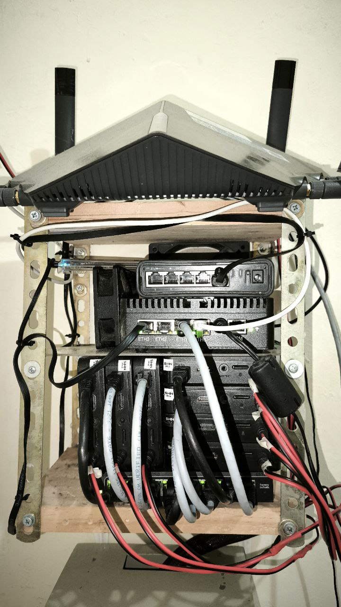
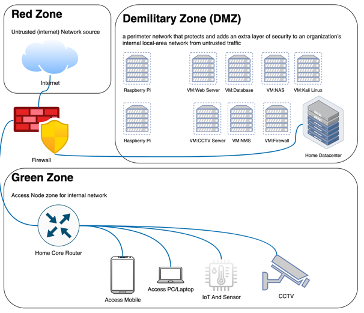
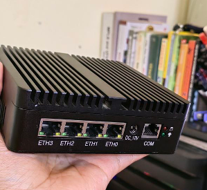
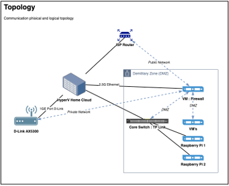
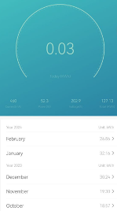
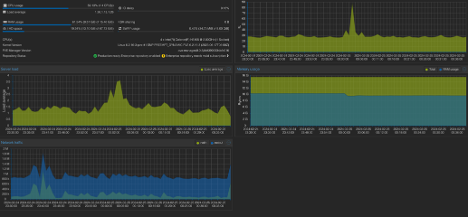

## A.	Data Center Definition
Data Center basically can be defined any space have main function for house of servers`[1][2]`. The servers in Data Center generally provide for digital services that we use on daily activity such as Video streaming, file sharing, web search, social networking, financial service and many more services that related with digital operation all provided in Data Center`[3]`. Nodes installed on data center not limited by Server, but also can install with another type, it’s depend on the function what we require on the Data Center. Basically Services is house for service. For example web service is installed on a server, but to access the services we can’t access without transport technology. So we need another node type for transport technology. And also for security we can’t let the server and transport node connect to public network. We need also for security function to protect the data center is safe. Safe on configuration, protocols and anything potentials ruin the services inside data center and servers. Transport what we mentioned is routers and the security devices we can also mention with firewall devices.
Commonly data center also designed with various methods. Both in physical and logical methods. In physical mechanism, Data Center mostly designed always redundant. Everything in physical must be redundant. Like service installed on physical server, normally installed on more than 1 server and each server protect the services. Once 1 server is down, like incident or maintenance, another server should be back up the services. Can we imagine for financial service, like bank account without protection. The incident always not predictable. Once the incident happen, how big bank losses incurred. Not only transaction failure, but also trust from customer will be decrease extremely. This will affected to the bank business and revenue `[4]`. To protect business value, need to protect the services. How to do, need to protect physically like multiple server, multiple power resources and multiple transmission path. Also need ensure all path transmission need to be secure. Logically to make the services is redundant, need to make a service is effective in logic and redundant by system. Like ensuring after 1 server is down, need mechanism to service can be move to another server can be alive. In special case, not only server and transmission need have redundant way, but also once 1 data center is down, should be has another data center need to back up. This issue is very rare but we need prepare the worst and well prepare. Who knows earthquake schedule? Who knows war like in Ukraine schedule? Nobody knows, so preparation is the best way to keep the services is safe.
## B.	Data Center Challange
Because of that’s so important the services inside data centers need consume power 24x7 per week uptime, and that’s not only 1 server. All server back-up also need to be uptime. If we see the specification of server for example HPE ProLiant DL380 Gen10 Server power specification can until 1600 W. Can we imagine if this kind of server we use for redundant server, need power ready 3200 W 24 Horus, 7 Days a week. In Indonesia, 1 home with medium package power is around 1200 W. so we can imagine, 1 service with 2 server Main and backup can turn on almost 3 house. This only for 1 service in 1 server. So with this case we can imagine, the main issue on Data Center is Power Consume. And to find the effectivity a data center we find using formula Power Usage Effectiveness (PUE). Basically PUE is an instantaneous representation of electrical energy consumption that encourages operators to report the minimum observed values of PUE`[1]`.
In professional data center, power consume and costing so big. Sample in Google consume with over than 1,120 GWh and $67 M, Microsoft with over than 600 GWh and $36M`[5]`. This is because various service is maintain in the services,numerous customers rely on infrastructure provided by large cloud companies with datacenters consisting of hundreds of thousands of servers `[3]`. Mostly the professional data center already consider for clean power source. It’s mean currently the power consume source from fossil energy. So big data center already deploy for clean energy such as solar panel, cooler by nature. And this measure for how clean data center can calculate with Carbone usage Effectiveness (CUE), CUE is defined as: CUE = Total CO Emissions caused by Total Datacenter Energy/IT Energy Con- sumption. The units of the CUE metric are kilograms of carbon dioxide equivalent (kgCO2e) per kilowatt-hour (kWh)`[5] [3]`. The power source is one of important on data center, and another things in power maintain is to deploy safe and reliable power, battery management system and anything related for power management, professional data center already deploy to build environment for clean and reliable data center in advantages `[6]`.
### C.	Home Data Center
Home Data Center what we raise in this article are implemented with picture as below. We deploy data center with an environment for supporting homework and research activity. 

Figure 1 Home Data Center Installation
Services maintain in home data center we tried is
-	Firewall 
-	NMS Server
-	Web Server
-	CCTV Server
-	Database Server
-	Security testing Kali Linux
-	IOT Server
And actually still can improve more, the limitation only the imagination. For the detail logical topology can refer to topology below

Figure 2 Topology Home Data Center Application

One of the most interesting is, with that’s services so much the device I used for data centers is very compact. We used for fanless mini PC. With specification 4 x Intel(R) Celeron(R) N5105 @ 2.00GHz and 16 GB of RAM. (Currently plan to upgrade the RAM into 64GB RAM), 2 pcs of SSD, 1 SSD NVME 256 GB and 1 SSD 1TB. For the picture can see figure below.

Figure 3 Home Server Devices
How we design for the physical and logical design can refer to below figure. The internet we got from one of the biggest ISP in Indonesia direct connect to physical server we installed for virtualization Hyper-V. The port direct connect from ISP used on VM Firewall, inside the Firewall the port will defined as Red Zone. So zones for the data center we have 3 Zones.
-	WAN Zone refer to Red Zone or Internet network (untrust Network)
-	LAN Zone refer to Green Zone or internal network (trust Network)
-	DMZ (Demilitarized Zone) is special network content for data center services.
The internet received by internal home also filtered from the firewall, so we strictly policed in the firewall both for Green Zone and of course for DMZ. And we always active feature of IPS and IDS especially network coming from Un-Trust Zone.

 
Figure 4 Phisical and Logical Design
The power usage also monitored every day. And the results is average power on around 52W. so Is big different if we compare to proper server in data center 52W vs 1600W. And It’s also count  Average consume 1.06 KWH and monthly power usage is around 32 KWh. With Price Power consume per KWH in Indonesia is 1.444 IDR, we consume per month average 46K IDR. This is so far if we compare but if we see the scale this is reasonable. 

Figure 5 Daily Power Used Home Data Center

Figure 6 Power Consume Monthly and Running
Home data center performance as below monitored by its server. The performance picture can refer to picture below. Currently RAM 16G is still maintain but often to full and make the server is freezing. For CPU with 4 Cores still maintain and with additional fan, te services is maintain.

Figure 7 Home Data Center Performance
Security of home data center we strictly policed in the firewall, activate for features can support the security such as IPS / IDS, Clam-V, etc. And in Security part also have feature VPN. To remote access from anywhere, we connect from this firewall to cloud VPN, and we can access from anywhere as long can access the VPN network. For logical topology can refer to picture as below

Figure 8 Security and Remote Access Topology

## D.	Reference:

[1]	J. Yuventi and R. Mehdizadeh, “A critical analysis of Power Usage Effectiveness and its use in communicating data center energy consumption,” Energy Build, vol. 64, pp. 90–94, 2013, doi: 10.1016/j.enbuild.2013.04.015.

[2]	J. G. Koomey, “Worldwide electricity used in data centers,” Environmental Research Letters, vol. 3, no. 3, Jul. 2008, doi: 10.1088/1748-9326/3/3/034008.

[3]	M. Noormohammadpour and C. S. Raghavendra, “Datacenter Traffic Control: Understanding Techniques and Tradeoffs,” IEEE Communications Surveys and Tutorials, vol. 20, no. 2. Institute of Electrical and Electronics Engineers Inc., pp. 1492–1525, Apr. 01, 2018. doi: 10.1109/COMST.2017.2782753.

[4]	J. Ceballos, R. Dipasquale, and R. Feldman, “Business continuity and security in datacenter interconnection,” Bell Labs Tech J, vol. 17, no. 3, pp. 147–155, 2012, doi: 10.1002/bltj.21565.

[5]	“Harnessing renewable energy in cloud datacenters- opportunities and challenges ”.

[6]	J. M. Pierson et al., “Datazero: Datacenter with zero emission and robust management using renewable energy,” IEEE Access, vol. 7, pp. 103209–103230, 2019, doi: 10.1109/ACCESS.2019.2930368.
 
