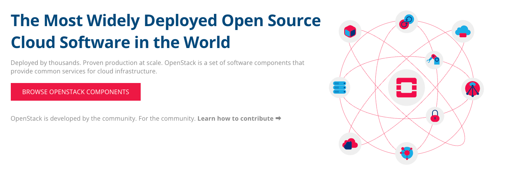
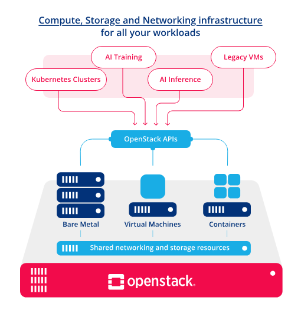
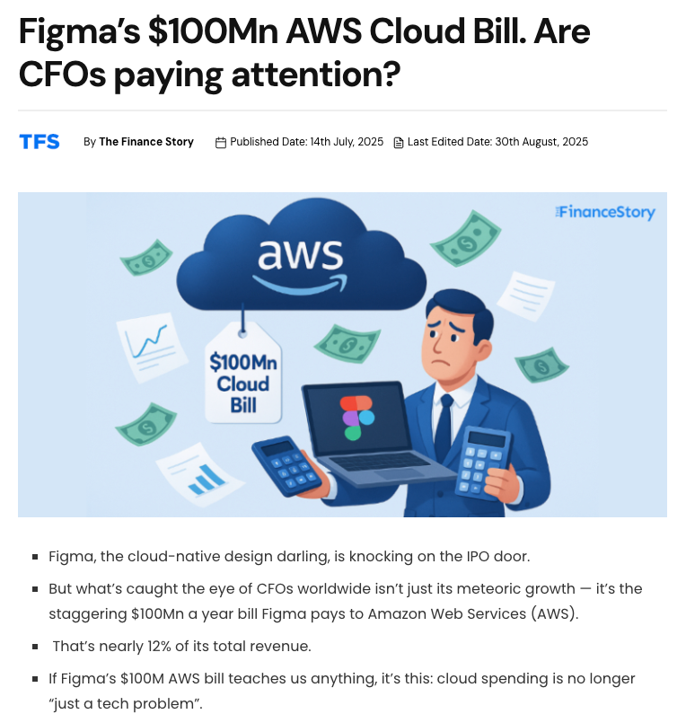
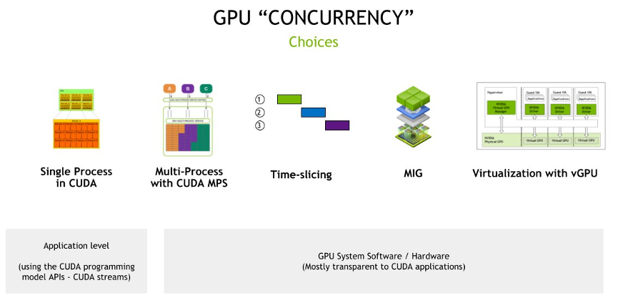
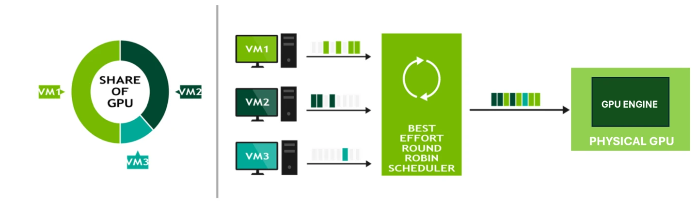
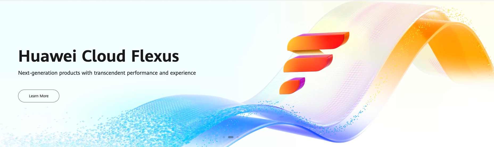

When we talk about **Cloud Computing**, one powerful way to imagine it is: **liquefying everything**. Just like water can take any shape, cloud computing allows computing resources to be flexible, scalable, and efficient. Instead of being locked inside a single server, resources can flow to where they are needed most.

Today, we see two major directions in computing:

* **Retail and personal computing:** Devices that are smaller, cheaper, and extremely power-efficient.
* **Industrial and enterprise computing:** Huge data centers with massive computing power, but designed for efficiency and scalability.

At first, it may seem like a contradiction—how can huge power also be efficient? The answer is virtualization and cloud computing.

## From Bare Metal to Cloud

In the **1970s**, IBM introduced the concept of virtualization. At that time, it was only for research, and not stable for big industries. In the **1990s and early 2000s**, companies still preferred **bare-metal servers** for stability:

* **Bare metal** = one server, one workload.
* **Virtualization** = dividing one server into many smaller workloads.

The real breakthrough came in the **mid-2000s**:

* **Amazon Web Services (AWS)** launched in **2006**.
* **Google Cloud** launched in **2008**.
* **Microsoft Azure** in **2010**.
* **Alibaba Cloud** in **2009**.
* **Huawei Cloud** in **2017**.

These services showed that virtualization was not only possible, but also profitable.

## Cloud Computing = Liquefied Resources

Think of a server with:

* **32 CPU cores**
* **128 GB RAM**
* **4 TB storage**

If you run it bare metal, only one system uses all of it. If the workload doesn’t need everything, the rest is wasted. With virtualization, you can divide it into smaller virtual machines (VMs), each with its own resources. This is like pouring water into multiple cups from one big container.

This concept works not only for CPU and RAM, but also for **storage and GPU**.

## Scalability is the Key

Scalability is one of the biggest reasons cloud computing is successful. Companies can start small and grow without buying new hardware. For example, consider **Figma**:
# Cloud Computing Liquefied Everything: The Future of Computing

## Introduction

When we talk about **Cloud Computing**, one powerful way to imagine it is: **liquefying everything**. Just like water can take any shape, cloud computing allows computing resources to be flexible, scalable, and efficient. Instead of being locked inside a single server, resources can flow to where they are needed most, adapting to the shape and size of the demand.

Today, we see two major directions in computing. On one side, we have **retail and personal computing**, where the focus is on small, low-power devices that are cheap but powerful enough to handle daily tasks. On the other side, there is **industrial and enterprise computing**, where huge data centers and servers provide massive amounts of computing power, but with an emphasis on efficiency, scalability, and cost control. At first, it seems like these two directions are in conflict. How can massive computing power also be efficient? The answer is virtualization and cloud computing.

## From Bare Metal to Cloud

Back in the **1970s**, IBM introduced the concept of virtualization. The idea was revolutionary: instead of dedicating one machine to a single workload, you could split the machine into many smaller parts. Each part could run its own workload independently. But in those early days, virtualization was still only for research and wasn’t stable enough for industries to adopt.

In the **1990s and early 2000s**, most companies still used **bare-metal servers**. These are physical servers where one machine is tied to one workload. The benefit was reliability and stability, but the drawback was inefficiency. If the workload didn’t use all the available resources, the rest was wasted. Virtualization was known, but it wasn’t trusted enough yet for large industries that required stability above everything else.

The turning point came in the **mid-2000s**, when cloud providers began to emerge:

* [Amazon Web Services (AWS)](https://aws.amazon.com/) launched in **2006**, pioneering the pay-as-you-go cloud model.
* [Google Cloud](https://cloud.google.com/) launched in **2008**.
* [Microsoft Azure](https://azure.microsoft.com/) arrived in **2010**.
* [Alibaba Cloud](https://www.alibabacloud.com/) entered the market in **2009**.
* [Huawei Cloud](https://www.huaweicloud.com/) followed in **2017**.

These services proved that virtualization could be trusted. More importantly, they showed that virtualization wasn’t just a technology—it was a business model that could change how companies operate.

## Cloud Computing = Liquefied Resources
Imagine you have a powerful server with **32 CPU cores**, **128 GB RAM**, and **4 TB storage**. If you dedicate all of this to one workload (bare metal), then only that workload benefits. If the workload doesn’t fully use the resources, the extra capacity is wasted.

With **virtualization**, the same server can be split into smaller **virtual machines (VMs)**:

* VM1: 4 CPU cores, 16 GB RAM, 500 GB storage
* VM2: 8 CPU cores, 32 GB RAM, 1 TB storage
* VM3: 2 CPU cores, 8 GB RAM, 250 GB storage

Each VM feels like an independent computer. They can run different operating systems, applications, or even serve different clients. The server is now being used much more efficiently. This is why we call cloud computing “liquefied resources.” Just like liquid, resources can be reshaped into any form depending on the demand.

## Scalability: The Real Power

One of the most important advantages of cloud computing is **scalability**. A company doesn’t need to predict its exact resource needs years in advance. Instead, it can start small and grow step by step as demand increases.

Take **Figma** as an example:

* Today, [Figma spends over \$300,000 per day on AWS](https://thefinancestory.com/figma-100mn-aws-bill-cloud-costs-rising). That’s more than **\$100 million every year**.
* But when Figma first started, its cloud bill was tiny. The company only paid for the small resources it needed to support its early users.

This flexibility is what makes cloud computing so powerful. Without scalability, startups like Figma would have needed huge upfront investments in hardware. Most of them wouldn’t have survived. Instead, cloud computing allowed them to grow naturally, adding more resources only as their user base and revenue increased.

Scalability is not just about saving money—it’s about enabling innovation. Developers can experiment with ideas without worrying about wasting large investments. If the idea grows, the infrastructure can grow with it.

## Storage Virtualization Explained

Storage is not as simple as just dividing space. It comes with unique challenges because data needs to be reliable, available, and easy to manage. Storage virtualization deals with three main problems:

* **Integrity:** Data must remain correct and not corrupted.
* **Replication:** Data should exist in more than one place for safety.
* **Maintenance:** Disks and drives fail, so the system must allow for easy repair and replacement.

Technologies like [Ceph](https://ceph.io/en/) and [ZFS](https://en.wikipedia.org/wiki/ZFS) provide solutions to these problems. For example, Ceph distributes data across many servers. If one disk fails, the system continues running without losing data. ZFS uses advanced methods like checksums to detect and repair corrupted data.

To visualize this, imagine pouring water into multiple containers. If one container cracks, the water is still safe in the other containers. That’s what storage virtualization does for data—it spreads it around so it can survive failures and continue flowing.

## GPU Virtualization Explained

GPUs are designed for parallel processing and are extremely powerful, but also very expensive. Traditionally, one GPU was used by one workload. But most workloads don’t always need the full power of a GPU. This created inefficiency.

**GPU virtualization** solves this by allowing multiple workloads to share a single GPU. This is like cutting a large cake into slices so multiple people can enjoy it, instead of one person eating the whole cake. It makes GPU resources accessible to more users at a lower cost.

Modern solutions include:

* [NVIDIA vGPU](https://docs.nvidia.com/vgpu/sizing/virtual-workstation/latest/right-gpu-vsoftware.html), which lets virtual desktops and AI workloads share a GPU.
* [AWS GPU time-slicing](https://aws.amazon.com/blogs/containers/gpu-sharing-on-amazon-eks-with-nvidia-time-slicing-and-accelerated-ec2-instances/), where expensive GPUs can be divided among many cloud users.
* [Microsoft Hyper-V GPU partitioning](https://learn.microsoft.com/en-us/windows-server/virtualization/hyper-v/gpu-partitioning), which partitions GPUs in Windows Server.
* [OpenStack vGPU](https://docs.openstack.org/charm-guide/latest/admin/vgpu.html), widely used by vendors like Huawei and ZTE.

GPU virtualization is technically more difficult than CPU or RAM virtualization because of how GPUs handle parallel tasks. But the payoff is huge: AI researchers, designers, and businesses can all share expensive GPU resources without each needing to buy dedicated hardware.

## Open Source and Vendor Support

The growth of cloud computing wasn’t only driven by big tech companies. Open-source projects also played a critical role. [OpenStack](https://www.openstack.org/), first released in **2010**, gave organizations a way to build their own private or public clouds. Companies like Huawei and ZTE used OpenStack to launch their own cloud services. This made cloud adoption accessible globally, not just in Silicon Valley.

Other vendors contributed as well:

* **VMware** set the standard for enterprise virtualization.
* **Red Hat OpenShift** connected cloud computing with containers and Kubernetes.
* [OpenMetal](https://openmetal.io/resources/blog/vgpus-with-openstack-nova/) extended GPU virtualization to OpenStack Nova.

Together, these ecosystems made cloud computing not only a service but also a global infrastructure.

## Conclusion

Cloud Computing truly **liquefies everything**. From CPU and RAM to storage and GPU, all resources can be divided, shared, and reshaped. This flexibility means:

* Companies can save money by using only what they need.
* Startups can grow step by step, scaling resources as they succeed, just like Figma.
* Enterprises can run huge workloads efficiently without wasting power or money.

The future will likely push this concept even further. More components of computing will become “liquefied,” giving industries and individuals new levels of flexibility and efficiency.

In the end, cloud computing is not just about technology. It’s about transforming computing power into a liquid form—flowing wherever it is needed, scaling smoothly as demands grow, and always balancing efficiency with profitability.

---

### References

* [AWS GPU Sharing on Amazon EKS](https://aws.amazon.com/blogs/containers/gpu-sharing-on-amazon-eks-with-nvidia-time-slicing-and-accelerated-ec2-instances/)
* [Microsoft Hyper-V GPU Partitioning](https://learn.microsoft.com/en-us/windows-server/virtualization/hyper-v/gpu-partitioning)
* [NVIDIA vGPU Sizing Guide](https://docs.nvidia.com/vgpu/sizing/virtual-workstation/latest/right-gpu-vsoftware.html)
* [VMware AI/ML Reference Architecture](https://www.vmware.com/docs/vmware-ai-ml-ra-ma)
* [Cloudeka: GPU Virtualization](https://www.cloudeka.id/id/berita/gpu/gpu-virtualization-definisi-keuntungan-dan-implementasinya/)
* [OpenStack vGPU Documentation](https://docs.openstack.org/charm-guide/latest/admin/vgpu.html)
* [OpenMetal: vGPU with OpenStack Nova](https://openmetal.io/resources/blog/vgpus-with-openstack-nova/)
* [NVIDIA OpenStack Cloud Image Guide](https://docs.nvidia.com/networking/display/public/sol/howto+create+openstack+cloud+image+with+nvidia+gpu+and+network+drivers)
* [Figma’s \$100mn AWS Bill](https://thefinancestory.com/figma-100mn-aws-bill-cloud-costs-rising)
* [Ceph Distributed Storage](https://ceph.io/en/)
* [ZFS Wikipedia](https://en.wikipedia.org/wiki/ZFS)
* [OpenStack](https://www.openstack.org/)
