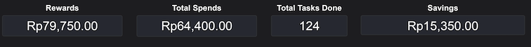
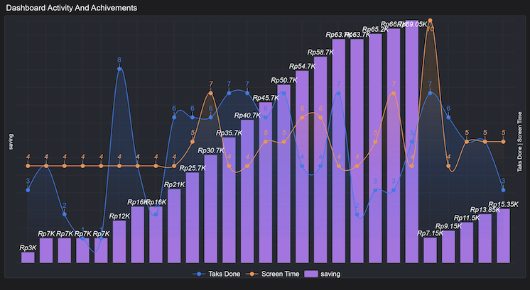
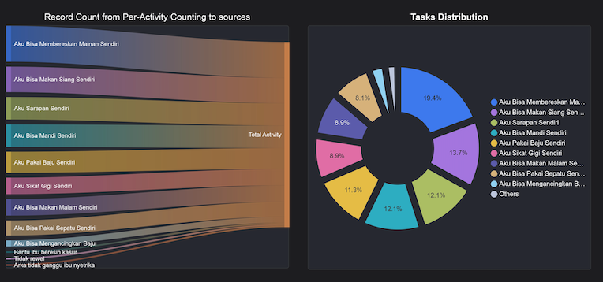
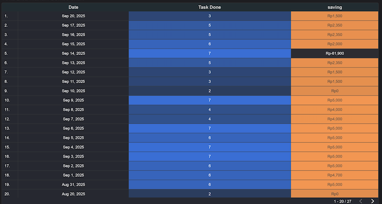
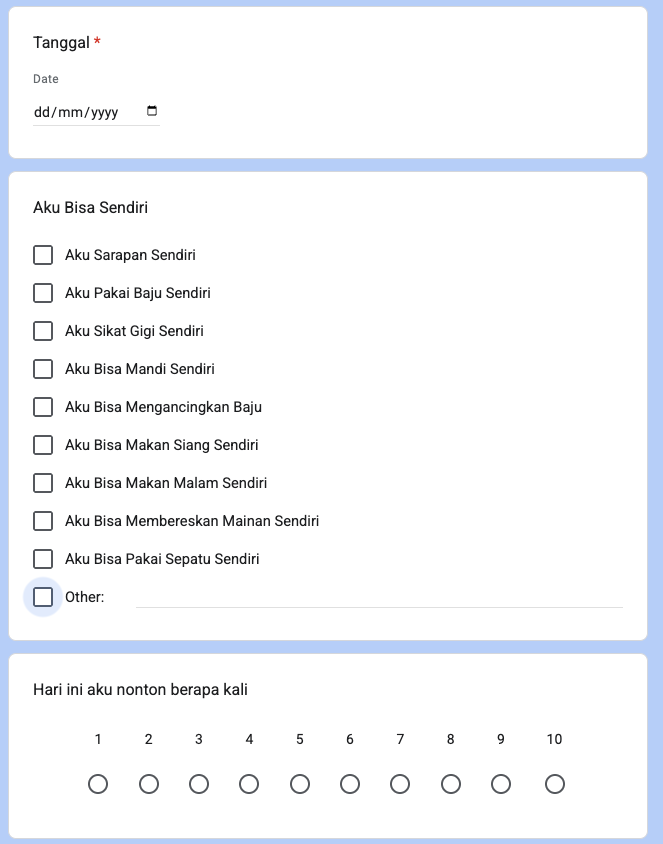
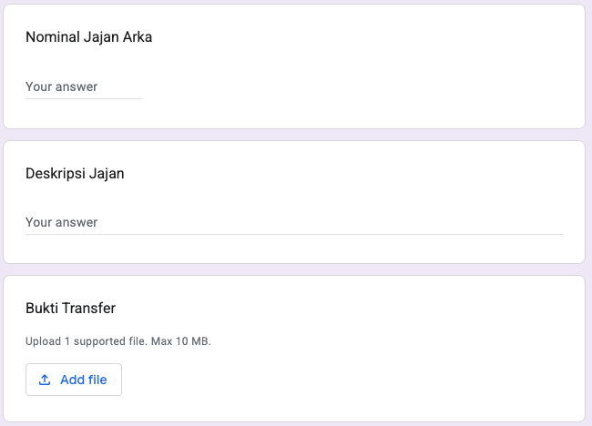

In today’s world, almost anything can be tracked, analyzed, and visualized. With Google Looker Studio, we can create dashboards that go beyond business reports—they can even be used for personal life management. One example I’ve built is a **daily task activity dashboard for my son**, turning everyday responsibilities into transparent, gamified achievements.

The system is simple but powerful:

1. **Google Form** is used to record daily activities—filled out by my son and my wife.
2. **Google Sheets** automatically collects the responses and becomes the structured data source.
3. **Looker Studio** connects to the Google Sheet, transforming the raw activity data into a dynamic, real-time dashboard.

This creates a seamless flow: input → database → visualization.

Here’s how the dashboard looks in practice:

* **Summary Results**

* **Activity and Achievements Chart**

* **Task Distribution Charts**

* **Detailed Table of Tasks and Achievements**

The **activity form** records daily actions:

The **spending nominal table** keeps track of point conversions into money:

Every completed task generates points. Points can be converted transparently into money, so whenever my son wants to buy something, he knows exactly how much more activity is needed to earn it.

This small experiment shows how dashboards are not only for companies, but also for families and individuals. Key advantages include:

* **Transparency**: The calculation and progress are visible to everyone.
* **Motivation**: Gamification encourages consistency in completing tasks.
* **Flexibility**: Any Google Form input can be turned into visual insights.
* **Scalability**: The same framework could be used for financial tracking, project monitoring, fitness goals, and more.

Looker Studio’s professional-grade features make this possible:

* Joining and blending multiple tables
* Applying rich formulas and data manipulation
* Offering a wide variety of charts and visualization options

What started as a way to motivate my son has evolved into a showcase of how accessible modern dashboarding can be. With free tools like Google Sheets and Looker Studio, anyone can transform raw data into a living, interactive story.

Data is no longer locked in spreadsheets—it becomes a transparent guide for better decisions, whether in business or at home.
