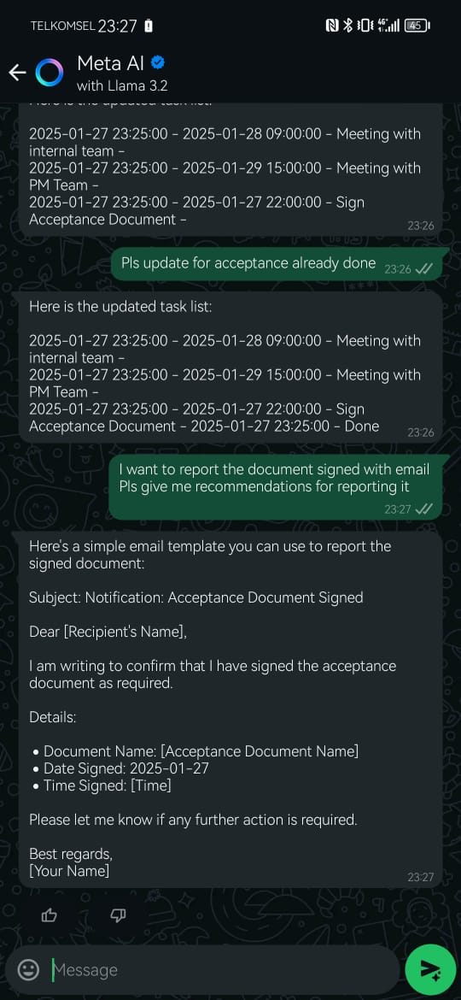
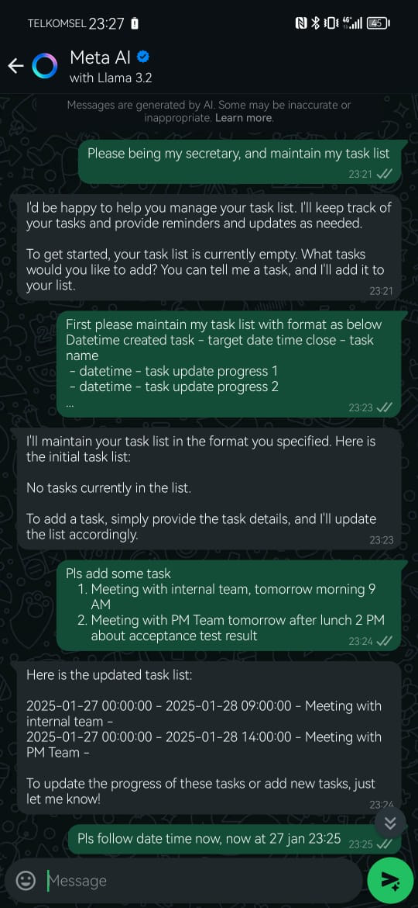
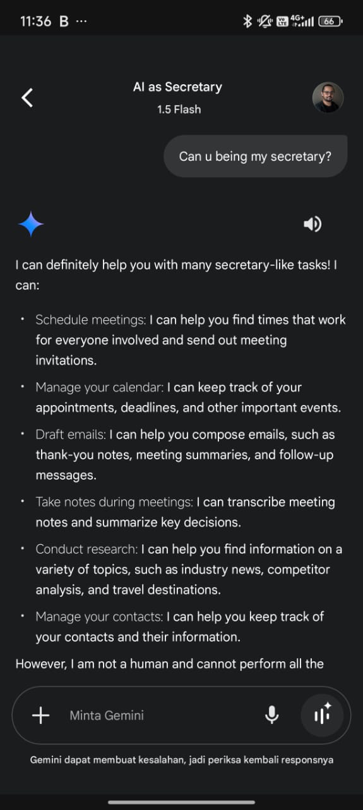
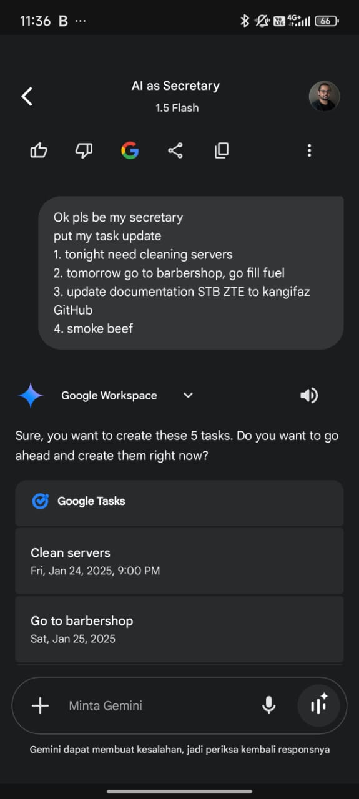

## Background

As professionals and employees, we often face challenges like `limited resources` whether it’s `not enough people` to delegate tasks, `not enough time` to get things done, or simply inefficient methods that waste time and energy. Many people still rely on manual or `traditional procedures`, which not only `slow down productivity` but can also lead to `increased costs` in the long run. 

Now, almost everyone is familiar with the `concept of Artificial Intelligence` (AI), but `implementing` it in daily tasks is still `not widespread`. It’s not just about AI’s capabilities being limited; often, `we as users don’t maximize the potential of AI` as a resource to help us. 

Think about common office tasks: arranging schedules, setting up meetings, sending reminders, drafting emails, or searching for information. These tasks are repetitive and time-consuming, and we all deal with them regularly. AI can simplify these tasks. Simply put, **AI is when machines can think, learn, and solve problems like humans**. It’s not as complicated as it sounds. AI can help with things like `organizing schedules`, `replying to messages`, `searching for information`, and even `automating tasks`. By `using AI`, you can `work faster` and `smarter`, **focusing on the important things like your job, studies, or personal goals.** And the best part? `Many AI platforms are free` or very affordable.

## Methods

There are many AI platforms available, but some of the most practical and accessible include `WhatsApp Meta AI`, `Gemini AI`, and others like `OpenAI`, `Samsung AI`, and `Apple AI`. Each has unique strengths, and here’s how they can help:

### WhatsApp Meta AI

WhatsApp is something almost all of us use every day for communication. Now, with Meta AI, you can use WhatsApp as a personal assistant. Imagine managing your tasks just by chatting. Meta AI allows you to:
- Add, edit, and close tasks through simple messages.
- Schedule reminders directly within your chats.
- Keep everything organized in the app you already rely on for work and personal communication.



This is one of the most convenient AI tools because it’s integrated into an app you’re already comfortable using.



What prompt I've used on whatsapp Meta AI


> **Me** : Please being my secretary, and maintain my task list
```
Meta    : I'd be happy to help you manage your task list. I'll keep track of your tasksand provide reminders and updates as needed.

To get started, your task list is currently empty. What tasks would you like to add? Youcan tell me a task, and I'll add it to your list.
```
> **Me** : First please maintain my task list with format as below Datetime created task - target date time close - task name
>  - datetime - task update progress 1
>  - datetime - task update progress 2

```
 Meta : I'll maintain your task list in the format you specified. Here is the initial task list:

No tasks currently in the list.

To add a task, simply provide the task details, and I'll update the list accordingly.
```

> **Me** : Add some tasks:
> 1. Meeting with internal team, tomorrow morning 9 AM
> 2. Meeting with PM Team tomorrow after lunch 2 PM about acceptance test result

```
Meta : Here is the updated task list:

2025-01-27 00:00:00 - 2025-01-28 09:00:00 - Meeting with internal team -
2025-01-27 00:00:00 - 2025-01-28 14:00:00 - Meeting with PM Team -

```

> **Me** : Please follow the current date and time. Now is 27 Jan 23:25.
```
Meta : Here is the updated task list with the current date and time:

2025-01-27 23:25:00 - 2025-01-28 09:00:00 - Meeting with internal team -
2025-01-27 23:25:00 - 2025-01-28 14:00:00 - Meeting with PM Team -
```

> **Me** : Reschedule the meeting with PM to 29 Jan at 15:00.
```
Meta : Here is the updated task list:

2025-01-27 23:25:00 - 2025-01-28 09:00:00 - Meeting with internal team -
2025-01-27 23:25:00 - 2025-01-29 15:00:00 - Meeting with PM Team -
```
> **Me** : Add another task: Need to sign the acceptance document and close it tonight before 22:00.
```
Meta : Here is the updated task list:

2025-01-27 23:25:00 - 2025-01-28 09:00:00 - Meeting with internal team -
2025-01-27 23:25:00 - 2025-01-29 15:00:00 - Meeting with PM Team -
2025-01-27 23:25:00 - 2025-01-27 22:00:00 - Sign Acceptance Document -
```
> **Me** : Mark the acceptance task as done.
```
Meta : Here is the updated task list:

2025-01-27 23:25:00 - 2025-01-28 09:00:00 - Meeting with internal team -
2025-01-27 23:25:00 - 2025-01-29 15:00:00 - Meeting with PM Team -
2025-01-27 23:25:00 - 2025-01-27 22:00:00 - Sign Acceptance Document - 2025-01-27 23:25:00 - Done
```

> **Me** : I want to report the document signed via email. Please give me a recommendation for the report.
```
Meta : Here's a simple email template you can use to report the signed document:

Subject: Notification: Acceptance Document Signed

Dear [Recipient's Name],

I am writing to confirm that I have signed the acceptance document as required.

Details:
• Document Name: [Acceptance Document Name]
• Date Signed: 2025-01-27
• Time Signed: [Time]

Please let me know if any further action is required.

Best regards,
[Your Name]
```


### Gemini AI

Gemini AI is an excellent alternative, especially for Android users. `It works seamlessly with the Google ecosystem`, making it easy to:
- Sync with Google Tasks and other Google services.
- Organize and prioritize your day with smart task suggestions.
- Use voice commands for hands-free assistance.



If you’re already using Android and Google’s environment, Gemini AI fits perfectly into your workflow.



### Other Options: Apple AI and Samsung AI

While I personally don’t use Apple AI (Siri) or Samsung AI (Bixby), they’re worth mentioning. These platforms offer advanced integration with their ecosystems:
- **Apple AI** provides seamless syncing across iPhones, Macs, and other Apple devices, allowing powerful voice commands and multitasking.
- **Samsung AI** excels in combining hardware and software, with tools like SmartThings for controlling smart devices.

### OpenAI for Advanced Tasks

`For more complex` and demanding tasks, I recommend OpenAI, especially their GPT-4o model (sometimes referred to as Model O1). It’s fantastic for writing, coding, or solving difficult problems. OpenAI offers unmatched flexibility for tackling professional challenges.

## Conclusion

**AI is not here to replace human resources**. This article is not about suggesting that we eliminate secretarial roles—their human touch and expertise are invaluable. However, for those of us who don’t have a personal secretary, `AI provides an amazing alternative`.

To use AI effectively, keep these points in mind:
- Identify repetitive tasks that AI can manage efficiently.
- Always double-check AI’s output to ensure accuracy.
- Use AI as a helper to enhance—not replace—your capabilities.

By leveraging AI strategically, you can significantly boost your productivity and focus on what truly matters. Whether you prefer WhatsApp Meta AI, Gemini AI, or advanced tools like OpenAI, there’s an option that fits your needs. Start exploring and see how AI can transform your workflow—it’s easier and more powerful than you think!

