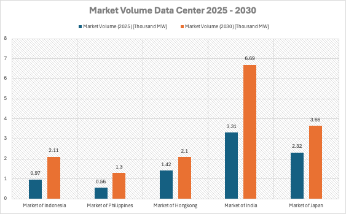
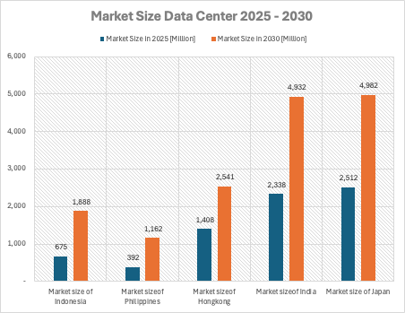
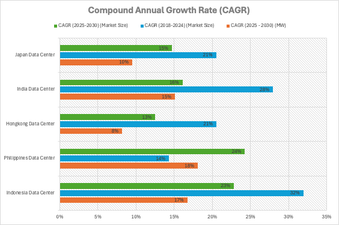
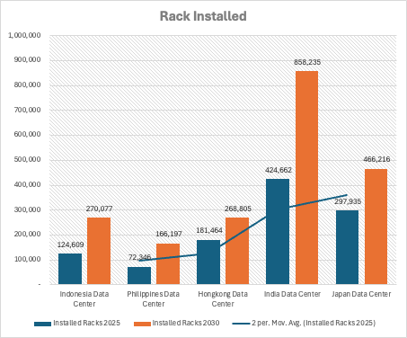
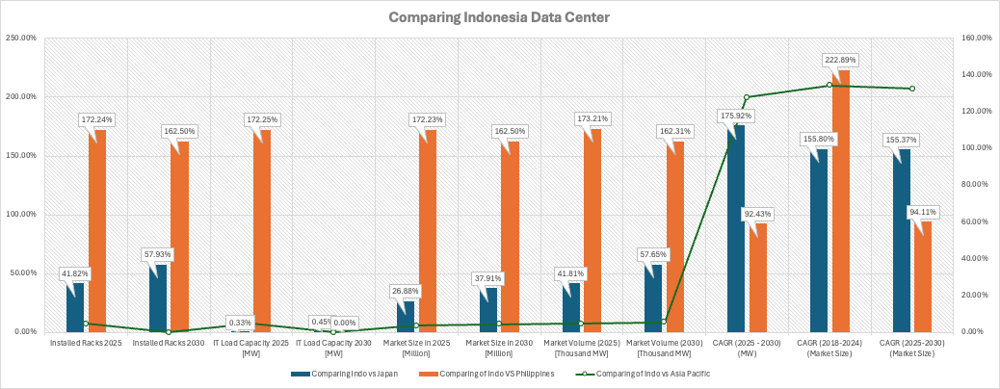

## Data Center Market Landscape
Specific look at The ASEAN data center market is experiencing significant growth, `driven by increasing digitalization` and a `rising demand` for cloud services. Singapore has long been the region’s primary hub due to its strong infrastructure, regulatory stability, and excellent connectivity. However, as Singapore reaches its capacity limits, opportunities are emerging in neighboring countries.

Indonesia is particularly noteworthy with its `population of 270 million` and an `internet penetration rate of 76.3%`, translating to over `212 million internet users`. This large population and growing digital adoption indicate substantial potential for data center expansion. Malaysia also presents attractive opportunities, especially in regions like Johor and Cyberjaya, which offer strategic locations and strong government incentives for foreign investments.

Vietnam is rapidly developing its digital infrastructure, supported by a young and tech-savvy population. While it faces challenges such as regulatory clarity and power availability, the demand for data centers is expected to grow as these issues are addressed. Thailand is positioning itself as a digital hub with significant investments in infrastructure and data sovereignty laws, making Bangkok an ideal gateway for regional connectivity.

Cloud adoption across ASEAN is on the rise, particularly in the public sector. Central governments show the `highest adoption rates at 71.4%`, followed by `universities (34%)`, `local governments (25.4%)`, and `hospitals (8.8%)`. Despite this growth, `39.6% of public institutions` plan to adopt cloud services in the near future. The main barrier remains concerns over data security and privacy, especially in the healthcare sector. Addressing these concerns through enhanced security measures will be crucial for further adoption.

Looking ahead, the correlation between increasing market demand and the need for robust data center supply is clear. As the ASEAN digital economy continues to expand, the demand for data centers will surge, necessitating strong supply solutions to meet these needs. In the next five years, advancements in cloud technology are expected to alleviate current concerns, fostering greater trust and widespread adoption.

Additionally, the `ICT industry in ASEAN is continuously evolving` with innovations in machine learning, artificial intelligence, and conventional system improvements. These advancements not only enhance data center efficiency but also address various societal challenges through improved algorithms and logical solutions.

The increasing demand for data correlates directly with the growing need for data centers in ASEAN. Singapore, despite its robust infrastructure, cannot single-handedly meet the region's demands. Collaboration with neighboring countries, such as Equinix's initiatives in Indonesia, is essential to address the spillover of unmet demand.

### Factors significantly influence this growth:

- **Digitalization Levels**: The extent to which digital technologies are adopted within a country drives the need for data infrastructure.
- **Regulatory Support**: Supportive regulations, including favorable tax policies and - streamlined permitting processes for data centers, are crucial for facilitating growth.
- **Innovation and Services**: The development of innovative services that meet the evolving needs of the population ensures sustained demand for data center services.

In simple terms, the market landscape and unmet demand in ASEAN are expected to continue growing. The rate of this growth will depend on the above factors, including how aggressively countries pursue digitalization, the strength of regulatory support, and the pace of innovation in the ICT sector.

Looking ahead, as the ASEAN digital economy continues to expand, the demand for data centers will surge, necessitating robust supply solutions to meet these needs. In the next five years, advancements in cloud technology are expected to alleviate current concerns, fostering greater trust and widespread adoption.

## Indonesia’s Market Position

### Market Volume Data Center 2025 - 2030
Indonesia’s data center market is on the rise, experiencing remarkable growth as it prepares to compete with other leading markets in Asia. `By 2025, the country’s market volume is expected to reach 0.97 thousand MW`, and by `2030, it will more than double to 2.11 thousand MW`. While it may not yet rival the giants like India or Japan, Indonesia’s rapid growth places it as a strong contender, even catching up with markets like Hong Kong.

India is leading the way in the region, with its data center capacity expected to grow significantly from 3.31 thousand MW in 2025 to 6.69 thousand MW in 2030. This impressive growth is driven by its large population, rapidly expanding digital economy, and extensive infrastructure projects. Japan, as a mature and advanced market, will see its capacity increase from 2.32 thousand MW in 2025 to 3.66 thousand MW in 2030, maintaining its role as a key player in Asia. However, both countries are growing at a more stable pace, creating opportunities for emerging markets like Indonesia to stand out.

Hong Kong presents a different scenario. As a financial hub, its data center market is projected to grow from 1.42 thousand MW in 2025 to 2.1 thousand MW in 2030, which is just slightly behind Indonesia. However, challenges such as limited land availability and high operating costs restrict Hong Kong’s potential for further growth, giving Indonesia an advantage with its lower costs and abundant resources.

On the other hand, the Philippines lags behind, with its data center capacity growing from 0.56 thousand MW in 2025 to 1.3 thousand MW in 2030. While the growth is steady, it doesn’t match the scale or investment momentum seen in Indonesia, which has firmly established itself as the leading emerging market in the region.

Indonesia’s growth is fueled by several factors. The country’s `digital transformation, driven by increasing demand` for cloud services and the rise of e-commerce, has created a surge in data center needs. Global tech giants like Amazon, Google, and Microsoft have already recognized this potential, investing heavily in the market. On top of that, government-backed initiatives such as “Indonesia 4.0” are laying the foundation for sustainable growth in the sector.

But the road isn’t without its challenges. `Indonesia must address infrastructure issues`, particularly in power reliability and connectivity, to fully capitalize on its potential. Competition with established markets like India and Japan is also fierce, but Indonesia’s 16.73% CAGR—one of the highest in the region—underscores its ability to rise above these hurdles.

With a strategic location in Southeast Asia, a growing digital economy, and a competitive cost structure, Indonesia is positioning itself as a major player in the data center industry. The next few years will be crucial as the country works to solidify its position and attract even more global investments.

Indonesia’s data center market isn’t just growing—it’s evolving into a cornerstone of Southeast Asia’s digital infrastructure. As the market continues to expand, Indonesia is poised to become a regional powerhouse, offering exciting opportunities for businesses and investors looking to tap into one of the fastest-growing digital markets in the world.

### Market Size Data Center 2025 - 2030

**Indonesia’s data center market is poised for significant growth**, fueled by the country’s booming digital economy and increased investments in digital infrastructure. `By 2025, the market size is projected to reach $675 million`, growing to `$1,888 million by 2030`, representing an `impressive CAGR of 22.84%.` This rapid expansion positions Indonesia as one of the fastest-growing data center markets in Asia.

Despite trailing behind regional giants like India ($4,932 million) and Japan ($4,982 million) by 2030, Indonesia’s market size surpasses the Philippines ($1,162 million) and is competitive with Hong Kong ($2,541 million). With rising demand for cloud computing, e-commerce, and digital services, Indonesia is becoming an attractive destination for global data center providers like AWS, Google, and Microsoft.

The government’s commitment to initiatives such as “Indonesia 4.0”, alongside increasing foreign investments, is driving this growth. However, challenges like power reliability and connectivity infrastructure remain critical factors that need to be addressed.

Indonesia’s strategic location, cost advantages, and untapped potential make it a key player in Asia’s data center landscape. As the market continues to expand, the country is set to compete with more mature markets, offering significant opportunities for investors and businesses looking to capitalize on the region’s digital transformation.

### Data Center Compound annual growth rate (CAGR)
The compound annual growth rate (CAGR) comparison paints a clear picture: Indonesia is emerging as the fastest-growing data center market in Asia, leading the way in market size expansion between 2025 and 2030. At 23% CAGR in market size and 17% CAGR in capacity (MW), Indonesia is showcasing its potential as a hub for digital transformation and infrastructure development.

While `India remains the dominant player in capacity growth, with a staggering 26% CAGR in MW, Indonesia’s balanced growth across both market size and capacity` reflects its strategic push for scaling digital infrastructure. India’s rapid capacity expansion highlights its role as a key regional leader, but Indonesia’s growth rate positions it as an attractive destination for global investments.

The Philippines, despite its smaller market, edges ahead with a 24% CAGR in market size, surpassing Indonesia in percentage terms. However, with a lower base, the impact of this growth is limited compared to Indonesia’s larger scale. Meanwhile, Japan and Hong Kong show slower growth rates of 15% CAGR in market size, emphasizing their status as mature markets with limited room for aggressive expansion.

For Hong Kong, challenges such as high operational costs and limited physical space hinder its capacity growth, which stands at just 8% CAGR. Japan, while maintaining stability, also focuses on optimizing its mature infrastructure, reflected in its 10% CAGR in capacity.

Indonesia’s growth story is driven by increasing demand for cloud computing, the rapid rise of e-commerce, and government-led digital transformation initiatives. Global tech giants like Amazon and Google are tapping into this growth, further boosting the country’s potential. With 23% CAGR in market size, Indonesia is setting itself apart as the most dynamic market in Southeast Asia.

However, challenges remain. The country must address infrastructure reliability and competition from established players like India and Japan. Despite this, Indonesia’s ability to attract investment and leverage its cost advantages makes it a standout market with the potential to become a major regional hub.

Indonesia isn’t just keeping up—it’s leading the charge in data center growth across Asia. Its balanced expansion in both market size and capacity underlines its commitment to becoming a key player in the digital economy. As global and regional demand continues to rise, Indonesia is well-positioned to capitalize on this momentum and solidify its place as a top destination for data center development.

### Growing Presence in Installed Racks
The numbers tell a powerful story: Indonesia’s data center market is on the rise, with the total number of installed racks `projected to more than double from 124,609 in 2025 to 270,077 in 2030`. This rapid growth highlights the country’s significant efforts to expand its digital infrastructure and meet the growing demands of the cloud computing and e-commerce sectors.

`While Indonesia is growing quickly,` it is still trailing behind regional giants like India and Japan in absolute numbers. India, the clear leader, is expected to nearly double its installed racks from 424,662 in 2025 to a staggering 858,235 by 2030. This reflects India’s position as the go-to destination for large-scale data center projects, driven by its massive population and a booming digital economy. Similarly, Japan will see steady growth, increasing from 297,935 racks in 2025 to 466,216 in 2030, solidifying its role as a mature and technologically advanced data center hub.

Hong Kong remains competitive, growing from 181,464 racks in 2025 to 268,805 by 2030, just slightly behind Indonesia. However, Hong Kong faces challenges such as land scarcity and higher operational costs, which may limit its ability to scale further. On the other hand, the Philippines shows promising growth, doubling its installed racks from 72,346 in 2025 to 166,197 in 2030. Despite its smaller size, the Philippines is making steady progress in developing its data center market.

Indonesia’s projected growth in installed racks is a testament to the country’s rising prominence in Southeast Asia. The more than doubling of racks from 2025 to 2030 reflects significant investments in digital infrastructure and the increasing adoption of cloud services by businesses and consumers. Indonesia’s strategic location and abundant resources provide it with a competitive edge over some of its regional peers, even as it works to close the gap with larger markets like India and Japan.

Indonesia’s impressive growth trajectory is fueled by several key factors:
- **Rising Digital Demand:** The explosion of e-commerce, fintech, and digital services in Indonesia has created a massive need for data storage and processing capabilities.
- **Global Investments:** Major players like Google, Amazon, and Microsoft are investing heavily in Indonesia’s data center infrastructure, further boosting its capacity.
- **Government Support:** Initiatives such as “Indonesia 4.0” are driving digital transformation, encouraging both domestic and foreign investments in the sector.

While Indonesia is on a strong growth path, it faces challenges such as power reliability, internet connectivity, and competition from regional leaders. However, its rapid growth rate, coupled with lower costs and abundant land, positions it as an attractive destination for data center expansion.

By 2030, Indonesia is set to become a key player in the Asian data center market, with 270,077 installed racks highlighting its growing capacity and influence. Although it lags behind India and Japan in absolute numbers, its rapid growth places it in a strong position to become a leading hub for digital infrastructure in Southeast Asia. As Indonesia continues to scale, it offers exciting opportunities for businesses and investors looking to be part of this digital revolution.

### Indonesia’s Data Center: A Comparative Growth Story

Indonesia’s data center market is on an impressive growth trajectory, solidifying its position as one of the fastest-growing markets in Southeast Asia. A closer look at key metrics reveals how Indonesia compares to regional players like Japan, the Philippines, and the broader Asia Pacific region, highlighting its rapid expansion and future potential.

#### Doubling Capacity by 2030

By `2025, Indonesia’s data centers will house 124,609 installed racks`, achieving 41.82% of Japan’s total racks and an impressive 172.24% of the Philippines’ capacity. By 2030, Indonesia’s rack count will more than double to 270,077, surpassing the Philippines by 162.50% and closing the gap with Japan, reaching 57.93% of its total racks. Compared to the Asia Pacific average, Indonesia’s contribution remains modest, but its steady growth signals a strong push for infrastructure expansion.

##### IT Load Capacity: Steady Growth Ahead

Indonesia is making significant strides in IT load capacity, aligning closely with Japan. `By 2025, Indonesia achieves 0.33% higher capacity than Japan` and maintains this momentum into 2030. When `compared to the Philippines, Indonesia outpaces it by a staggering 172.25% in 2025`, demonstrating its dominance in the region. However, relative to the Asia Pacific, Indonesia’s contribution remains consistent at around 4.78%, leaving room for further growth and regional impact.

#### Market Size: A Rising Digital Economy

Indonesia’s data center market size tells a compelling story of growth. `By 2025, the market is expected to reach $675 million, which is 26.88% of Japan’s market size and an amazing 172.23% of the Philippines’ total`. By 2030, Indonesia’s market size will grow to $1.88 billion, improving to 37.91% of Japan’s total     while maintaining its strong lead over the Philippines at 162.50%.   Within the Asia Pacific, `Indonesia’s contribution to the total market size grows modestly to 4.67%,` emphasizing its rising significance.

#### Market Volume: Expanding at Full Speed

Indonesia’s market volume, measured in thousand MW, highlights its accelerating growth. By 2025, `Indonesia achieves 41.81% of Japan’s volume` and an `impressive 173.21% of the Philippines’`` capacity, showcasing its ability to scale rapidly. By 2030, Indonesia narrows the gap with Japan, achieving 57.65% of its volume, while continuing to outpace the Philippines by 162.31%. Compared to the Asia Pacific, Indonesia’s share grows slightly to 5.61%, signaling its increasing role in the region’s data center landscape.

#### CAGR: Leading the Growth Pack

`Indonesia’s Compound Annual Growth Rate (CAGR) underscores its status as a market leader.` Between 2025 and 2030, `Indonesia’s CAGR for IT load capacity (MW) reaches 175.92% compared to Japan and 92.43% compared to the Philippines,` highlighting its infrastructure’s rapid scaling. For market size, Indonesia’s CAGR of 155.37% aligns closely with Japan and exceeds the Asia Pacific average by 132.41%, positioning it as one of the most dynamic players in the region.

Indonesia’s Growth in Context
- Against Japan: While Japan remains a dominant and mature market, Indonesia is steadily narrowing the gap, particularly in installed racks, IT load capacity, and market volume.
- Against the Philippines: Indonesia consistently outpaces the Philippines across all metrics, establishing itself as the clear leader in Southeast Asia.
- Within Asia Pacific: Although Indonesia’s contributions remain relatively modest compared to the Asia Pacific total, its rapid growth rates and increasing capacity position it as a rising star in the regional market.

Indonesia’s data center market is undergoing a transformative phase, driven by strong demand for digital services, rapid adoption of cloud computing, and substantial investments from global tech giants. With its doubling capacity, robust CAGR, and expanding market share, Indonesia is poised to become a significant player in the Southeast Asian and Asia Pacific digital economy.

As Indonesia continues to close the gap with regional leaders and address infrastructure challenges, it offers exciting opportunities for businesses and investors looking to tap into one of the fastest-growing data center markets in the world.

## Conclusion
Indonesia’s data center market is on a transformative journey, experiencing one of the highest growth rates in the region and solidifying its position as a critical player in Asia’s digital economy. With projections showing exponential growth across key metrics such as market size, installed racks, IT load capacity, and market volume, Indonesia is rapidly outpacing smaller markets like the Philippines and is well-positioned to rival established players such as Hong Kong in the near future.

### A Market Poised for Growth

By 2030, Indonesia’s data center market is expected to:
- Market Size: Expand from $675 million in 2025 to $1.88 billion, with a CAGR of 23%, the highest among its peers.
- Installed Racks: Double in capacity from 124,609 racks in 2025 to 270,077 racks, surpassing the Philippines by over 162% and closing the gap with Hong Kong and Japan.
- Market Volume: Increase from 0.97 thousand MW in 2025 to 2.11 thousand MW, nearly matching Hong Kong and continuing to outpace the Philippines.

While India and Japan remain dominant in absolute size, Indonesia’s rapid expansion highlights its potential to play a much larger role in the region. India, for example, will maintain its leadership with 858,235 racks and 6.69 thousand MW market volume by 2030, while Japan continues its steady growth with 466,216 racks and 3.66 thousand MW. Yet, Indonesia’s high CAGR and dynamic growth trajectory make it a compelling market for future investment.

Indonesia’s competitive edge lies in several key factors:
1.	**Strategic Location:** As the largest economy in Southeast Asia, Indonesia is geographically well-positioned to serve as a regional hub for data center operations, connecting the region to global digital infrastructure.
2.	**Cost Advantages:** Compared to high-cost markets like Hong Kong and Japan, Indonesia offers lower operational costs and abundant land, making it an attractive destination for large-scale data center projects.
3.	**Government Support:** Initiatives such as “Indonesia 4.0” and other digital transformation policies are driving investments and fostering a business-friendly environment.
4.	**Global Investments:** Major players like Google, Amazon, and Microsoft are tapping into Indonesia’s potential, further accelerating its growth and infrastructure development.
Challenges to Address

While Indonesia’s growth is impressive, challenges remain:
- **Infrastructure Reliability:** Power supply stability and connectivity remain key areas requiring improvement, particularly in remote regions.
- **Policy and Regulation:** Ensuring consistent and favorable regulations for international investors will be critical to sustaining growth.
- **Competition from Regional Leaders:** Indonesia faces stiff competition from India and Japan, both of which have established ecosystems and larger economies of scale.
A Look to the Future

Indonesia’s data center market is at a pivotal moment. By maintaining its growth momentum and addressing its challenges, the country has the potential to become a leading hub for data center operations in Southeast Asia and beyond. It is already outpacing smaller markets like the Philippines and narrowing the gap with Hong Kong, thanks to its aggressive expansion and cost advantages.

For investors and stakeholders, Indonesia represents an exciting opportunity to capitalize on a market that is not only growing rapidly but also strategically positioned to play a central role in Asia’s digital future. However, achieving sustained market leadership will require continued investments in infrastructure, strong policy support, and a focus on innovation.

Indonesia’s data center market is more than just a growth story—it’s a transformation in the making. With its strong growth trajectory, competitive cost structure, and strategic regional role, Indonesia is emerging as a key player in the Asian data center landscape. While it still trails behind giants like India and Japan in absolute size, its potential to outpace mature markets like Hong Kong is evident.

The road ahead for Indonesia is filled with opportunities. As the demand for digital services and cloud computing continues to rise, Indonesia’s role in the global data economy will only become more significant. Investors who recognize this potential early and align with the country’s digital transformation efforts are likely to reap significant rewards. The time to invest in Indonesia’s data center market is now.

**Reference :**
---

- [Penetrasi Internet Indonesia Peringkat ke-8 di ASEAN](https://databoks.katadata.co.id/teknologi-telekomunikasi/statistik/ab3ed5c473c3e15/penetrasi-internet-indonesia-peringkat-ke-8-di-asean-siapa-teratas)
- [Pengguna Internet Indonesia Peringkat ke-3 Terbanyak di Asia](https://databoks.katadata.co.id/teknologi-telekomunikasi/statistik/c456be24de4e6df/pengguna-internet-indonesia-peringkat-ke-3-terbanyak-di-asia)
- [Survei: Hanya 30% dari 169 Lembaga Publik Indonesia yang Mengadopsi Cloud](https://databoks.katadata.co.id/teknologi-telekomunikasi/statistik/3b4b5a4bf9867db/survei-hanya-30-dari-169-lembaga-publik-indonesia-yang-mengadopsi-cloud)
- [Banyak Lembaga Publik Belum Gunakan Layanan Cloud](https://databoks.katadata.co.id/teknologi-telekomunikasi/statistik/2e77ee0da3fafe3/banyak-lembaga-publik-belum-gunakan-layanan-cloud-apa-alasannya)
- [Equinix Akan Bangun Data Center di Jakarta Tahun Depan](https://www.tempo.co/ekonomi/equinix-akan-bangun-data-center-di-jakarta-tahun-depan-nilai-investasi-tembus-rp-1-18-triliun-1168101)
- [Mordorintelligence](mordorintelligence.com)