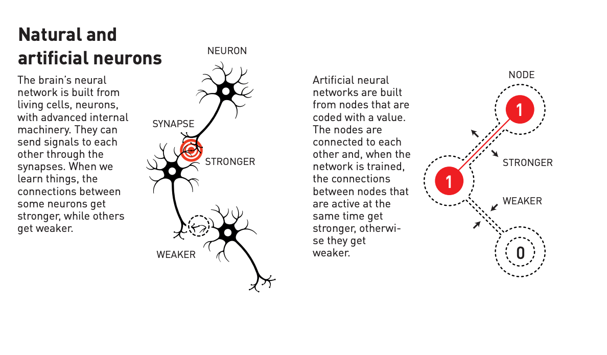
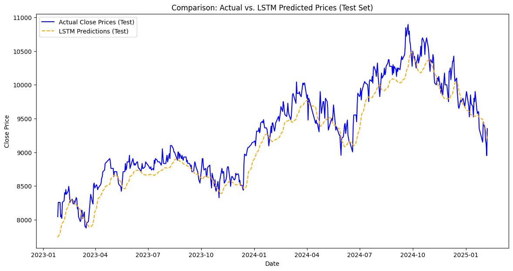
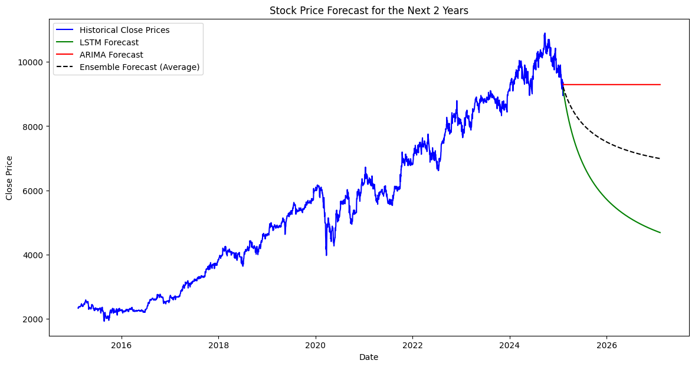

## **1. The Inspiration Behind Machine Learning: A Nobel Prize Story**
In 2004, the [Nobel Prize](https://www.nobelprize.org/prizes/physics/2024/press-release/) in Physics was awarded to `David J. Gross`, `H. David Politzer`, and `Frank Wilczek` for their discoveries concerning the strong interaction in quantum chromodynamics. While their work was rooted in particle physics, the advancements in understanding complex interactions inspired research in various fields, including `artificial intelligence (AI)` and `machine learning (ML)`. Around the same time, researchers were diving deeper into the concept of artificial neural networks, mimicking the human brain's ability to process information. Just as neurons in our brain store and transmit signals to learn and adapt, machine learning models began leveraging similar structures to improve memory, recognition, and decision-making.

The idea of [neural networks](https://www.nobelprize.org/uploads/2024/10/fig2_fy_pop_en_241009_neuronVSnod-2.pdf) dates back even further to the 1940s, but it wasn’t until computational power caught up that these models could be effectively trained. Inspired by how the human brain processes and recalls information, researchers aimed to replicate cognitive functions in machines, giving rise to deep learning models that continue to evolve today.

## **2. The Expanding Role of ML and AI Across Industries**
Since the rise of AI and ML, these technologies have become `Since AI and ML became more advanced`, they have started changing industries in a big way. These technologies are helping businesses work better and connect with customers in new ways. Many sectors have seen big improvements because of `AI’s ability` to process `large amounts of data`, `automate tasks`, and `make predictions`.

- **ICT Industry:** AI improves search engines, helps manage networks, strengthens cybersecurity, and makes interactions between humans and machines smoother with natural language processing.

- **Retail & E-commerce:** Companies use AI to suggest products, run chatbots for customer service, predict demand, and improve supply chains, making shopping experiences better.

- **Automotive:** AI plays a huge role in self-driving cars, helping vehicles understand their surroundings and drive safely using computer vision and machine learning.

- **Finance:** AI is making a big impact in finance, helping to analyze stock trends, detect fraud, and automate trading. However, finance is a unique industry where AI also brings risks. Since the market is driven by money, AI-powered trading and financial predictions could bring both benefits and disruptions.

## **3. Challenges in AI and ML Development**
Even though AI has made great progress, there are still `many challenges in its development`. One of the biggest issues is that `ethics and legal standards for AI are not yet fully` defined. This can `lead to problems` with `copyright`, `laws`, and `moral concerns`, especially when AI models are trained using large amounts of data without clear ownership rules.

Another challenge is the `availability of resources`. AI development requires `high-performance hardware` like GPUs or TPUs, which `consume a lot of power.` This raises concerns about energy usage and sustainability. At the same time, human resources are also limited. AI research and development need skilled professionals, but there are not enough experts in the field to keep up with the growing demand.

AI models also `struggle with accuracy`. Even the most advanced models can still make mistakes, and `these errors can have serious consequences`, especially in areas `like healthcare or finance`. 
> **Ensuring that AI systems are reliable and trustworthy is an ongoing challenge.**

As AI continues to evolve, addressing these challenges will be crucial to making sure it remains a positive force for progress.

## **4. Alexa Experiment: Stock Price Forecasting with LSTM and ARIMA to Get Insight**
As a finance and technology enthusiast, I try to learn and build a simple model using Long `Short-Term Memory (LSTM)` networks to predict stock prices. LSTMs, a type of `recurrent neural network (RNN)`, are well-suited for time-series forecasting, making them ideal for analyzing historical stock data.

All resources that I used can be view on my [Repository Pages](https://github.com/kangifaz/repo/blob/main/machine-also-can-learn/Machine%20Also%20Can%20Learn.ipynb).

I gathered stock market data, preprocessed it, and trained an LSTM model to recognize patterns and predict future trends. While the model provided insightful predictions, it also highlighted the complexities of financial markets, where external factors such as global events and economic policies play a significant role. This experiment reinforced the importance of continuous learning and improvement in AI models.

Stock price forecasting has always been a challenging task due to the **complexity of financial markets**. In this experiment, I attempted to predict the **future stock prices of BBCA (Bank Central Asia)** using two different approaches:  
- **Long Short-Term Memory (LSTM)**, a deep learning model capable of understanding time-series data.
- **AutoRegressive Integrated Moving Average (ARIMA)**, a traditional statistical model widely used in financial forecasting.

The purpose of this study was not to create a perfect forecasting model but to **gain insights into how different machine learning models behave in financial forecasting**. Additionally, I explored a **combination of both models (ensemble forecast)** to see if merging predictions could improve accuracy.

---

### **a. Data Collection and Preprocessing**
Before we begin forecasting, **data preparation is crucial**. The data used in this experiment consists of:
1. **BBCA_history_price.csv** – Containing historical price data (Open, High, Low, Close, Volume).
2. **BBCA-financials.xlsx** – Containing financial ratios and performance metrics.

### **Key Preprocessing Steps**
- **Filtering the last 10 years of data** to focus on recent trends.
- **Exploratory Data Analysis (EDA)** to visualize patterns in stock prices.
- **Data normalization** using Min-Max Scaling for better deep learning performance.
- **Feature engineering** to create sequences of past prices for the LSTM model.

---

### **b. Exploratory Data Analysis (EDA)**
Exploratory Data Analysis (EDA) is **one of the most important steps in data science** because it allows us to identify **patterns, trends, and anomalies** before applying any machine learning models.

#### **EDA Process:**
1. **Visualization of Historical Prices**  
   - A time-series plot was generated to observe the long-term trend of BBCA stock prices.
   - It revealed a general upward trend but with fluctuations due to market conditions.

2. **Correlation Analysis**  
   - A heatmap of financial indicators was created to identify relationships between variables.
   - Understanding which financial metrics correlate with stock prices can help improve forecasting models.

3. **Handling Missing Data**  
   - Any missing values were carefully handled to ensure model reliability.
   - If missing values were found in financial reports, interpolation or forward-filling was applied.

---

### **c. Forecasting Using LSTM (Deep Learning)**
#### **What is LSTM?**
LSTM (**Long Short-Term Memory**) is a **special type of Recurrent Neural Network (RNN)** designed to **handle time-series data**. Unlike traditional neural networks, LSTM has **memory cells** that allow it to learn long-term dependencies.

#### **How We Used LSTM**
1. **Creating Input Sequences**  
   - A **sliding window approach** was used, where the model learns from the **last 60 days of stock prices** to predict the next day's price.

2. **Building the LSTM Model**  
   - **Two LSTM layers** were added to capture time-series dependencies.
   - **Dropout layers** were included to prevent overfitting.
   - A **Dense output layer** was used for final price predictions.

3. **Training and Testing**  
   - The dataset was split into **80% training data and 20% testing data**.
   - The model was trained using **Adam optimizer** and **Mean Squared Error (MSE) loss function**.

#### **Advantages of LSTM**
✅ **Handles long-term dependencies** in stock price movements.  
✅ **Adapts to non-linear patterns**, making it more suitable for financial forecasting.  
✅ **Learns patterns without requiring explicit feature engineering**.  

---

### **d. Forecasting Using ARIMA (Traditional Statistical Model)**
#### **What is ARIMA?**
ARIMA (**AutoRegressive Integrated Moving Average**) is a **time-series forecasting model** that assumes stock prices are influenced by **past values and error terms**.

#### **How We Used ARIMA**
1. **Model Selection**  
   - We analyzed the **Autocorrelation Function (ACF)** and **Partial Autocorrelation Function (PACF)** plots.
   - The best order was determined as **(5,1,0)**, meaning:
     - *p = 5*: The past 5 values influence future predictions.
     - *d = 1*: The data was differenced once to remove trends.
     - *q = 0*: No moving average component was used.

2. **Training and Forecasting**  
   - ARIMA was trained on **historical stock prices** and forecasted the **next 2 years**.

#### **Advantages of ARIMA**
✅ **Interpretable and efficient** for short-term forecasting.  
✅ **Works well on stationary time-series data**.  
✅ **A widely used method in econometrics and finance**.  

---

### **e. Combining the Forecasts (Ensemble Model)**
Since LSTM and ARIMA have **different strengths**, I combined them into an **ensemble forecast** by averaging predictions.

#### **Why Ensemble Forecasting?**
- LSTM captures **complex, non-linear patterns**.
- ARIMA models **linear trends**.
- By **combining both models**, we get a **balanced forecast**.

#### **Final Ensemble Formula**
\[
\text{Ensemble Forecast} = \frac{\text{LSTM Forecast} + \text{ARIMA Forecast}}{2}
\]

---

### **f. Results and Insights**
#### **1. LSTM Performance on Test Data**
📌 **Comparison of Actual vs. Predicted Prices (Test Set)**  

- The **LSTM model closely followed actual stock prices**, with some deviations.
- Predictions were **smoother than actual prices**, meaning it captured trends but missed short-term volatility.

#### **2. 2-Year Forecast Comparison**
📌 **Forecasting the Next 2 Years**  

- **ARIMA Prediction (Red Line)**: A flat trend, showing it struggles with capturing recent price volatility.
- **LSTM Prediction (Green Line)**: Predicts a downward trend, which may be **influenced by recent bearish trends**.
- **Ensemble Prediction (Black Dashed Line)**: A more balanced estimate, combining **both the trend-following nature of ARIMA and the adaptability of LSTM**.

---

### **g. Conclusion**
1. **LSTM performed well for short-term predictions** but showed **limitations in long-term forecasting**.
2. **ARIMA worked for basic trend-following but lacked complexity**.
3. **The ensemble forecast provided the most stable prediction**, balancing **trend and volatility**.
4. **Real-world forecasting should include external economic indicators** such as **interest rates, inflation, and market sentiment**.
5. **More advanced hybrid models (LSTM + XGBoost) could be tested for improved accuracy**.

---

### **h. Limitations and Disclaimer**
🛑 **Disclaimer:**  
🚨 **This study is purely for research and educational purposes.**  
📉 **It is NOT financial advice and should NOT be used for trading or investment decisions.**  

#### **Limitations of This Experiment**
- **External factors like economic policies, global events, and investor sentiment are not considered**.
- **The model was trained only on past price movements**, without fundamental analysis.
- **Predictions may not reflect actual future movements** due to the unpredictable nature of financial markets.

💡 **This research is intended to explore machine learning applications in stock forecasting and inspire future improvements.**

---

### **i. Future Improvements**
- 📌 **Integrate fundamental analysis** (revenue, earnings, interest rates).
- 📌 **Experiment with hybrid models** (LSTM + ARIMA + XGBoost).
- 📌 **Use sentiment analysis on news and social media**.
- 📌 **Test alternative deep learning architectures** (GRU, Transformer models).

🔍 **This study shows how AI and ML can be applied in stock forecasting, but financial markets remain highly unpredictable.**  
🚀 **Further research and model improvements are necessary for practical use!**  

### **6. Conclusion**
In my [recent project](https://github.com/kangifaz/repo/blob/main/machine-also-can-learn/Machine%20Also%20Can%20Learn.ipynb), `I explored how AI can learn from large amounts of data` by attempting to predict stock prices using models like LSTM. `This experiment highlighted AI’s impressive capabilities` but also underscored `challenges` such as `high energy consumption`, the need for `specialized hardware`, and `concerns about accuracy`. Moreover, `ethical issues`, including potential legal and moral implications, remain significant hurdles in AI development.

As someone passionate about ICT, data, and finance, I am committed to `continually exploring and learning in these fields`. Through this blog, I aim to share insights and developments on how we can harness AI and machine learning to improve our lives, while being mindful of the associated challenges.

