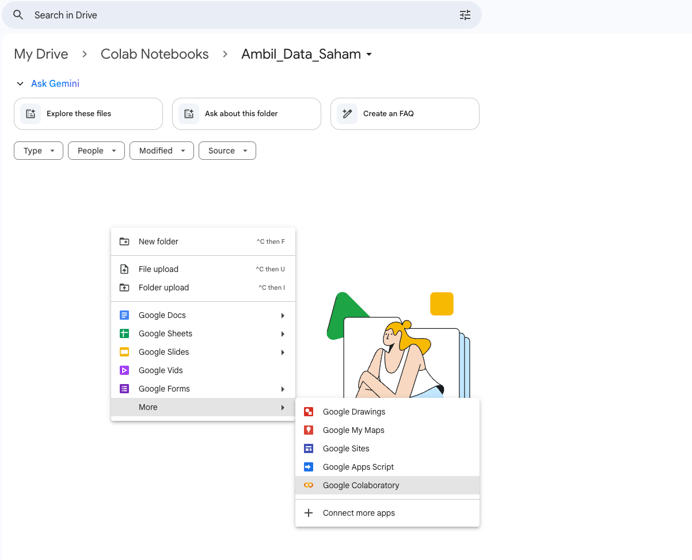
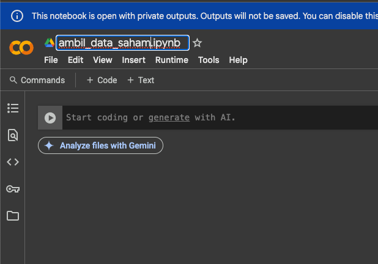
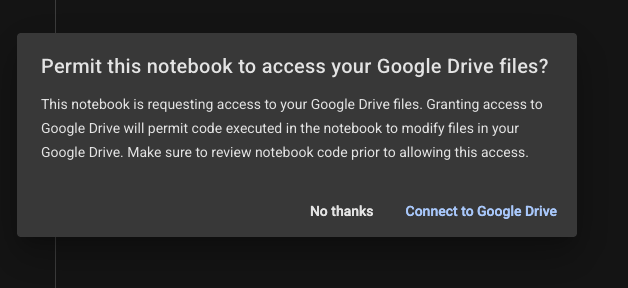
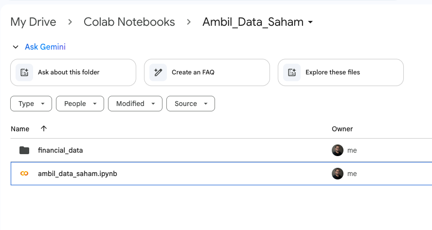
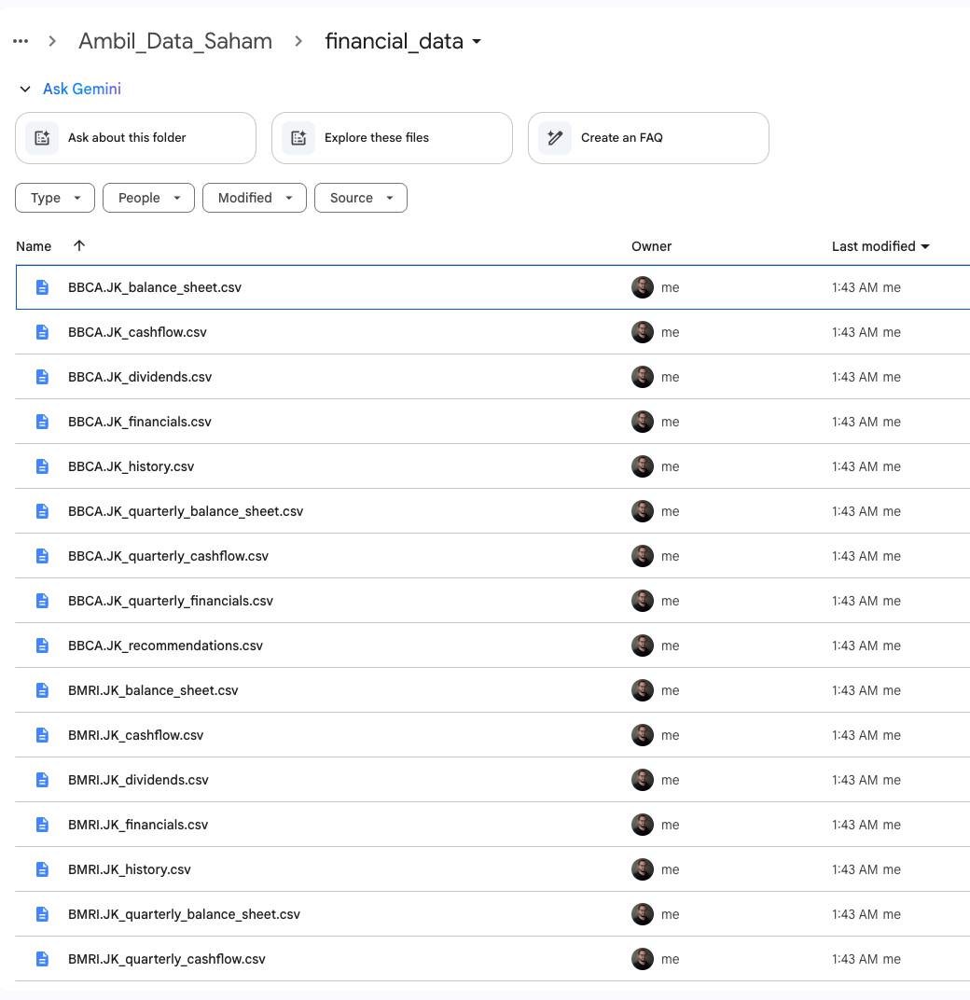
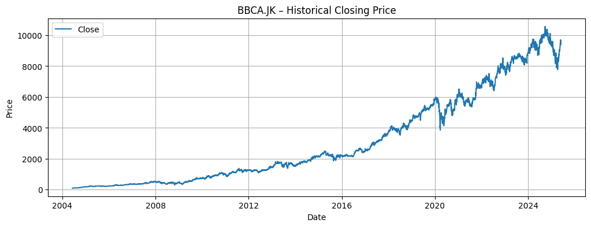
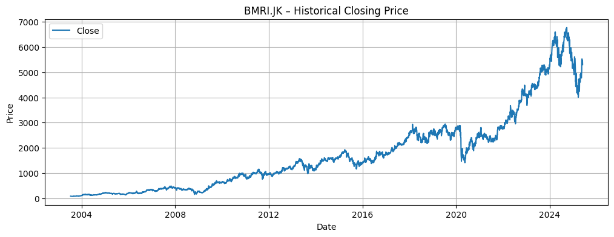
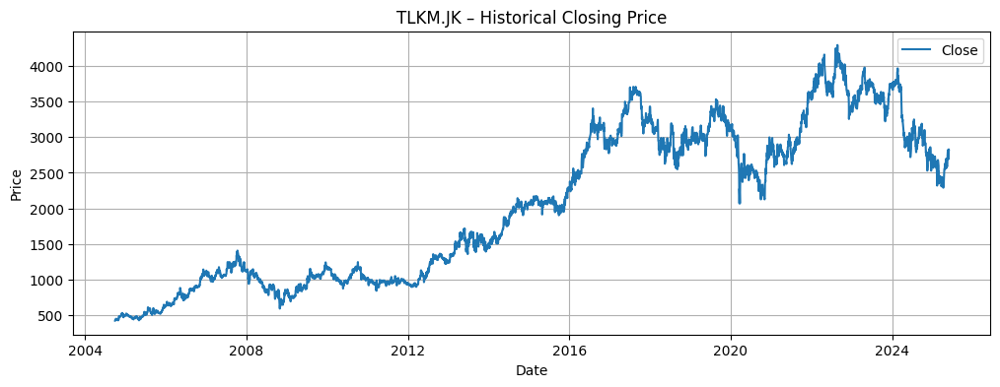

This article special write for my special partners, and all who need to use this kind of scenario to make easy any task. This article mainly focusing on `How to take data from` [Yahoo finance or yfinance](https://finance.yahoo.com/) using `Python programming language without you need to learn deeply how programming is`.

Of Course if you learn programming that's much better, but in case you're limited resources, time, basic knowledge of ICT or anything, I hope this article can be like sparks to motivate you to learn programming. Start to feels what's benefit of programming language learning, than I hove can be a motivation to learn this.

### 1. Create New Project on Google Drive - Google Colab
Open any directory that you want to use for Google Colab. Google Colab is an enviroment using python programming language, with base similar with [Jupyter Lab](https://jupyter.org/). So once you can use this enviroment, also can use your laptop using similar enviroments.

### 2. Create new project

Follow sample capture as below to open new project 



### 3. Setup the Enviroment

Change file Name, and you can explore what inside of google colab feaatues, windows anythings My First sugestion is `Rename File or Project Name`. This will help you to maintain your enviroment especially when you have various project on it.



At field ``` Start coding or generate with AI ``` actually you can start to write down your code by yourself. 

### 4. Start Prompting
As My promise, We try `not use programming language in advance`, we try use our own language, human language like English or even in Bahasa Indonesia. In this case I'm using Another AI like Chat GPT, even you can use also Gemini from Google but let's make a collaboration between AI. Sample that Used is [ChatGPT](https://chatgpt.com) with prompt I used as below :

```
I just make a project using google colab, please help me to create a python programs, allow me to take financial data, history chart as much as possible that u can provide on yfinance API with specific ticker on the programs, and allow multiple ticker
sample at the program must allow multiple ticker like BBCA, BMRI, TLKM etc
```
From the prompt then get result to released script as below :

```
# 1) Install yfinance (if not present) and mount Google Drive
!pip install yfinance --upgrade --quiet

from google.colab import drive
drive.mount('/content/drive') # 

import os
import yfinance as yf
import pandas as pd
import matplotlib.pyplot as plt

# 2) Create (or confirm) a folder in your Drive for saving CSVs
save_dir = '/content/drive/MyDrive/financial_data'
os.makedirs(save_dir, exist_ok=True)

# -- EDIT THIS LIST: Add any tickers you want to fetch below (without .JK) --
tickers_input = ['BBCA', 'BMRI', 'TLKM']
# --------------------------------------------------------------------------------

# 3) Ensure each ticker ends with '.JK' (for IDX/Indonesia). You can remove this
#    logic or adapt it if you’re fetching tickers from other exchanges.
formatted_tickers = []
for t in tickers_input:
    t = t.strip().upper()
    if not t.endswith('.JK'):
        t = t + '.JK'
    formatted_tickers.append(t)

# 4) Loop over each formatted ticker, fetch data, save CSVs, and plot history
for ticker in formatted_tickers:
    try:
        print(f'\n===== Processing {ticker} =====')
        tk = yf.Ticker(ticker)

        # --- A) Historical Price Data (Max available, daily) ---
        hist = tk.history(period='max', interval='1d')
        if hist.empty:
            print(f'⚠️ No historical price data for {ticker}')
        else:
            hist_path = os.path.join(save_dir, f'{ticker}_history.csv')
            hist.to_csv(hist_path)
            print(f'✔️ Historical data saved to: {hist_path}')

            # Plot the closing-price history
            plt.figure(figsize=(12, 4))
            plt.plot(hist.index, hist['Close'], label='Close')
            plt.title(f'{ticker} – Historical Closing Price')
            plt.xlabel('Date')
            plt.ylabel('Price')
            plt.legend()
            plt.grid(True)
            plt.show()

        # --- B) Annual Financial Statements & Related Data ---
        financials      = tk.financials         # Income Statement (annual)
        balance         = tk.balance_sheet      # Balance Sheet (annual)
        cashflow        = tk.cashflow           # Cash Flow (annual)
        dividends       = tk.dividends          # Dividends paid
        recommendations = tk.recommendations    # Analyst recommendations

        # --- C) Quarterly Financials ---
        q_financials = tk.quarterly_financials
        q_balance    = tk.quarterly_balance_sheet
        q_cashflow   = tk.quarterly_cashflow

        # --- D) Save each DataFrame if not empty ---
        if not financials.empty:
            path = os.path.join(save_dir, f'{ticker}_financials.csv')
            financials.to_csv(path)
            print(f'✔️ Annual financials saved to: {path}')
        if not balance.empty:
            path = os.path.join(save_dir, f'{ticker}_balance_sheet.csv')
            balance.to_csv(path)
            print(f'✔️ Annual balance sheet saved to: {path}')
        if not cashflow.empty:
            path = os.path.join(save_dir, f'{ticker}_cashflow.csv')
            cashflow.to_csv(path)
            print(f'✔️ Annual cash flow saved to: {path}')
        if not dividends.empty:
            path = os.path.join(save_dir, f'{ticker}_dividends.csv')
            dividends.to_csv(path)
            print(f'✔️ Dividends saved to: {path}')
        if recommendations is not None and not recommendations.empty:
            path = os.path.join(save_dir, f'{ticker}_recommendations.csv')
            recommendations.to_csv(path)
            print(f'✔️ Analyst recommendations saved to: {path}')

        if not q_financials.empty:
            path = os.path.join(save_dir, f'{ticker}_quarterly_financials.csv')
            q_financials.to_csv(path)
            print(f'✔️ Quarterly financials saved to: {path}')
        if not q_balance.empty:
            path = os.path.join(save_dir, f'{ticker}_quarterly_balance_sheet.csv')
            q_balance.to_csv(path)
            print(f'✔️ Quarterly balance sheet saved to: {path}')
        if not q_cashflow.empty:
            path = os.path.join(save_dir, f'{ticker}_quarterly_cashflow.csv')
            q_cashflow.to_csv(path)
            print(f'✔️ Quarterly cash flow saved to: {path}')

    except Exception as e:
        print(f'❌ Error processing {ticker}: {e}')

print("\n✅ Finished processing all tickers. Check your Google Drive folder for the CSV files.")  
```
### 5. Swim Over the Code Before Deep Dive On It!
The script generated from AI basically is result of what we want as prompted. From the script also we already know some part is need to be adjust following what our purposes. 

#### Directory Part
At below part need ensure directory that u need to use for output file will save.
``` 
# 2) Create (or confirm) a folder in your Drive for saving CSVs
save_dir = '/content/drive/MyDrive/financial_data'
os.makedirs(save_dir, exist_ok=True)
```
#### Which Stock Code Ticker Will take
At Below part need to adjust which stock code need to take
```
# -- EDIT THIS LIST: Add any tickers you want to fetch below (without .JK) --
tickers_input = ['BBCA', 'BMRI', 'TLKM']
```
after all is set and we're ready to run, Click `Run` can use button on left side of code, or also can use `Runtime > Run All`. After run then the notification will pop up to ask access of Google Colab to save the output on your Drive



Let the program finish and save an output on the drive as below


Also check the file output as below


Results from 




```
rive already mounted at /content/drive; to attempt to forcibly remount, call drive.mount("/content/drive", force_remount=True).

===== Processing BBCA.JK =====
✔️ Historical data saved to: /content/drive/MyDrive/Colab Notebooks/Ambil_Data_Saham/financial_data/BBCA.JK_history.csv

✔️ Annual financials saved to: /content/drive/MyDrive/Colab Notebooks/Ambil_Data_Saham/financial_data/BBCA.JK_financials.csv
✔️ Annual balance sheet saved to: /content/drive/MyDrive/Colab Notebooks/Ambil_Data_Saham/financial_data/BBCA.JK_balance_sheet.csv
✔️ Annual cash flow saved to: /content/drive/MyDrive/Colab Notebooks/Ambil_Data_Saham/financial_data/BBCA.JK_cashflow.csv
✔️ Dividends saved to: /content/drive/MyDrive/Colab Notebooks/Ambil_Data_Saham/financial_data/BBCA.JK_dividends.csv
✔️ Analyst recommendations saved to: /content/drive/MyDrive/Colab Notebooks/Ambil_Data_Saham/financial_data/BBCA.JK_recommendations.csv
✔️ Quarterly financials saved to: /content/drive/MyDrive/Colab Notebooks/Ambil_Data_Saham/financial_data/BBCA.JK_quarterly_financials.csv
✔️ Quarterly balance sheet saved to: /content/drive/MyDrive/Colab Notebooks/Ambil_Data_Saham/financial_data/BBCA.JK_quarterly_balance_sheet.csv
✔️ Quarterly cash flow saved to: /content/drive/MyDrive/Colab Notebooks/Ambil_Data_Saham/financial_data/BBCA.JK_quarterly_cashflow.csv

===== Processing BMRI.JK =====
✔️ Historical data saved to: /content/drive/MyDrive/Colab Notebooks/Ambil_Data_Saham/financial_data/BMRI.JK_history.csv

✔️ Annual financials saved to: /content/drive/MyDrive/Colab Notebooks/Ambil_Data_Saham/financial_data/BMRI.JK_financials.csv
✔️ Annual balance sheet saved to: /content/drive/MyDrive/Colab Notebooks/Ambil_Data_Saham/financial_data/BMRI.JK_balance_sheet.csv
✔️ Annual cash flow saved to: /content/drive/MyDrive/Colab Notebooks/Ambil_Data_Saham/financial_data/BMRI.JK_cashflow.csv
✔️ Dividends saved to: /content/drive/MyDrive/Colab Notebooks/Ambil_Data_Saham/financial_data/BMRI.JK_dividends.csv
✔️ Analyst recommendations saved to: /content/drive/MyDrive/Colab Notebooks/Ambil_Data_Saham/financial_data/BMRI.JK_recommendations.csv
✔️ Quarterly financials saved to: /content/drive/MyDrive/Colab Notebooks/Ambil_Data_Saham/financial_data/BMRI.JK_quarterly_financials.csv
✔️ Quarterly balance sheet saved to: /content/drive/MyDrive/Colab Notebooks/Ambil_Data_Saham/financial_data/BMRI.JK_quarterly_balance_sheet.csv
✔️ Quarterly cash flow saved to: /content/drive/MyDrive/Colab Notebooks/Ambil_Data_Saham/financial_data/BMRI.JK_quarterly_cashflow.csv

===== Processing TLKM.JK =====
✔️ Historical data saved to: /content/drive/MyDrive/Colab Notebooks/Ambil_Data_Saham/financial_data/TLKM.JK_history.csv

✔️ Annual financials saved to: /content/drive/MyDrive/Colab Notebooks/Ambil_Data_Saham/financial_data/TLKM.JK_financials.csv
✔️ Annual balance sheet saved to: /content/drive/MyDrive/Colab Notebooks/Ambil_Data_Saham/financial_data/TLKM.JK_balance_sheet.csv
✔️ Annual cash flow saved to: /content/drive/MyDrive/Colab Notebooks/Ambil_Data_Saham/financial_data/TLKM.JK_cashflow.csv
✔️ Dividends saved to: /content/drive/MyDrive/Colab Notebooks/Ambil_Data_Saham/financial_data/TLKM.JK_dividends.csv
✔️ Analyst recommendations saved to: /content/drive/MyDrive/Colab Notebooks/Ambil_Data_Saham/financial_data/TLKM.JK_recommendations.csv
✔️ Quarterly financials saved to: /content/drive/MyDrive/Colab Notebooks/Ambil_Data_Saham/financial_data/TLKM.JK_quarterly_financials.csv
✔️ Quarterly balance sheet saved to: /content/drive/MyDrive/Colab Notebooks/Ambil_Data_Saham/financial_data/TLKM.JK_quarterly_balance_sheet.csv
✔️ Quarterly cash flow saved to: /content/drive/MyDrive/Colab Notebooks/Ambil_Data_Saham/financial_data/TLKM.JK_quarterly_cashflow.csv

✅ Finished processing all tickers. Check your Google Drive folder for the CSV files.
```
### 6. Note
- If you found any error, just copy the error and paste on the AI, let's AI fix the program by itself
- If has any supporting team, partner, expert anyone who familiar with programming, can ask him/her directly to make easy to understand

### 7. Reference FIle
Above experiment is alco can u see on the main refrence as below :
- [GPT Prompt](https://chatgpt.com/share/683b4ebe-3c6c-8013-9304-e123cb097606)
- [Google Colab Sample](https://colab.research.google.com/drive/1LI2KKHKYGz7oyf6UmNoTK9dCoEsUMQ8K?usp=sharing)
