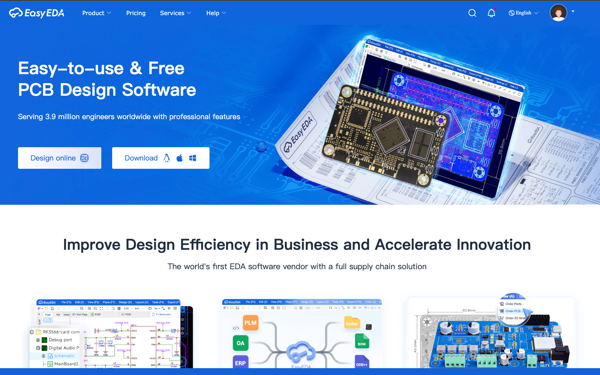
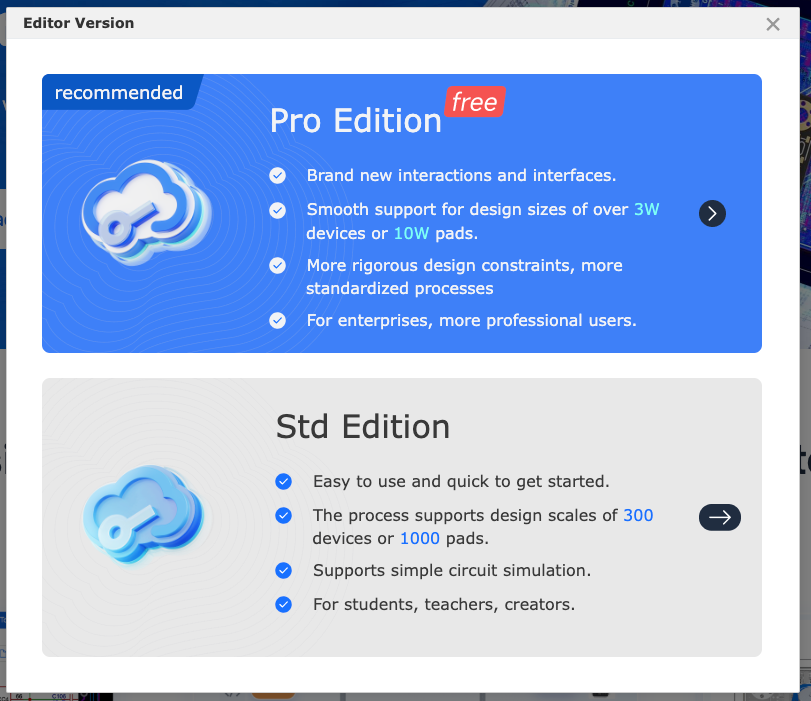
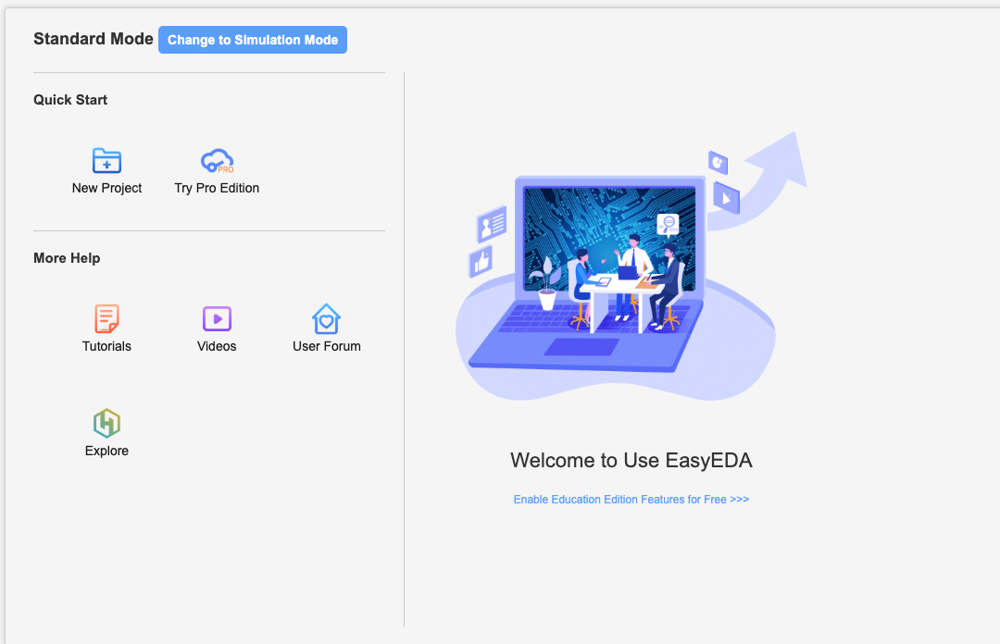
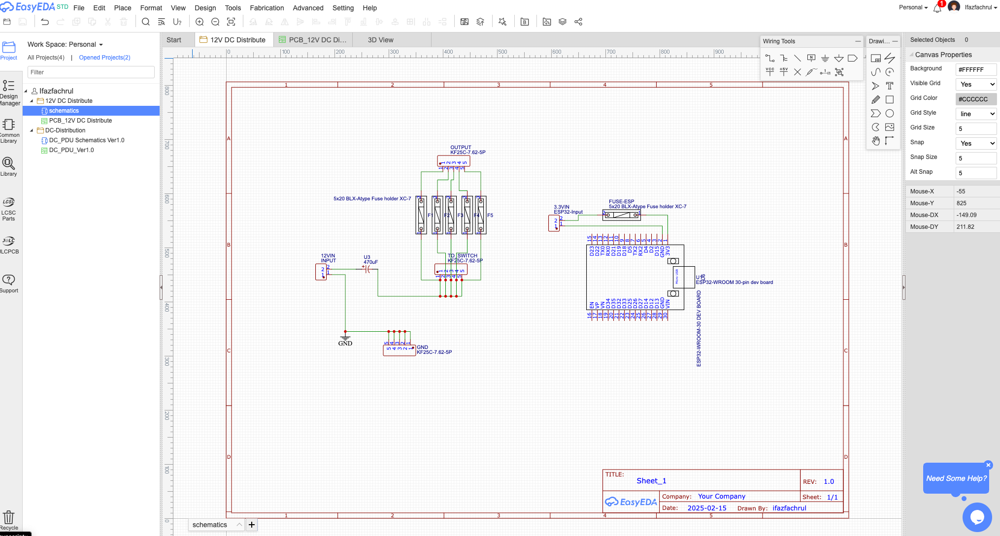
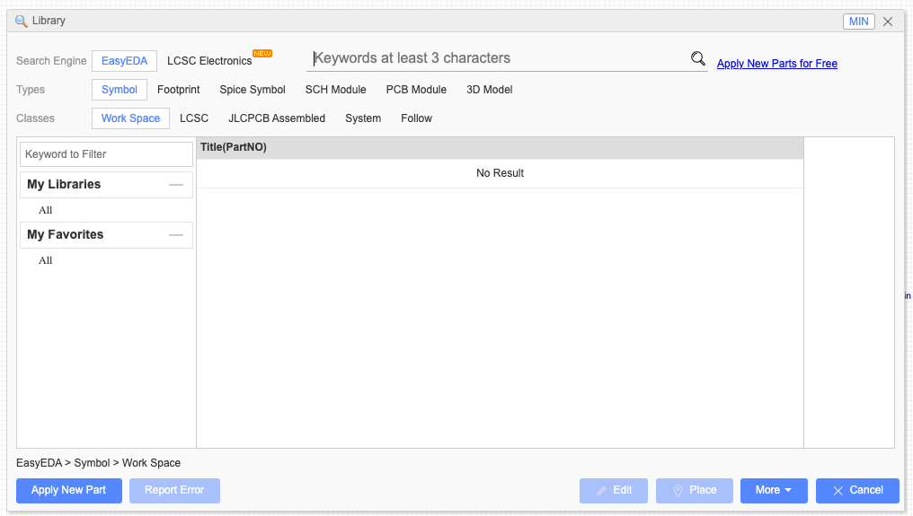
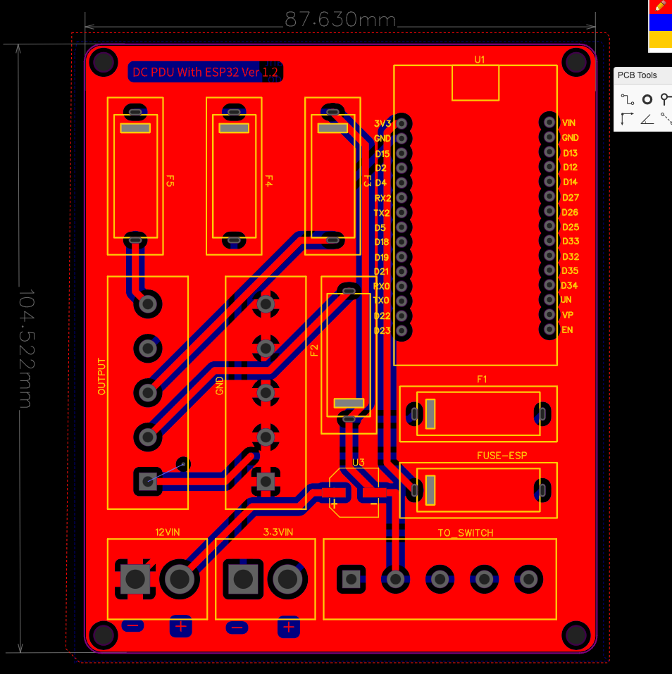
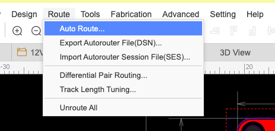

Designing a PCB has never been easier with [EasyEDA](https://easyeda.com/). It is a free and powerful tool that enables engineers and hobbyists to design schematics, create PCB layouts, and even order manufactured boards directly.

## Getting Started

### 1. Choose Online Design Mode
1. Go to [EasyEDA](https://easyeda.com/).
2. Click **"Design Online"**.
3. Click **"Free"** to start using the online editor.

### 2. Create a New Project
1. Click **"New Project"** to start a new PCB design.
2. Enter the project name and description.
3. Click **"Create"**.

### 3. Create a Schematic Diagram
1. Open the **Schematic Editor**.
2. Add components from the **Library**.
3. Connect components using **wires**.

### 4. Choose the Right Library Components
1. Open the **Library**.
2. Search for the required components.
3. Ensure the material type matches the intended PCB design.

### 5. Convert Schematic to PCB Layout
1. Once the schematic is complete, click **"Convert to PCB"**.
2. Adjust component placement on the PCB board.
3. Define board outline and layer settings.

### 6. Design PCB Routing
1. Use the **Auto Router** for automatic trace routing.
2. Adjust the trace width and clearance as per the PCB design rules.
3. Place **vias** if needed for multi-layer routing.

### 7. View in 2D and 3D Mode
1. Switch to **2D view** to inspect the PCB layout.
2. Switch to **3D view** to visualize the final design.

## Final Steps
- **Run a DRC (Design Rule Check)** to verify errors in the layout.
- **Generate Gerber Files** for PCB manufacturing.
- **Order PCB** directly from EasyEDA or export the design for another manufacturer.

## Sample Project
Here's my sample project, which can be downloaded from my [repository on DC DU with ESP32](https://github.com/kangifaz/repo/tree/main/pcb-dc-du-12v-with-esp32).

The `main idea behind this project is to expand the capabilities and improve the reliability` of my home data center network. Currently, the data center relies on PLN (the main power grid). In the event of an outage, the entire system goes down. Another critical issue is the unstable output from my PSU, which poses a significant risk to my devices.

To address these problems, I plan to switch the PSU source to a **DC UPS**. The UPS capacity will be calculated based on Jakarta's power outage frequency, which is rare, with a maximum downtime of approximately two hours. The UPS will be sized accordingly to ensure sufficient backup power during outages.

Additionally, I have multiple IoT sensors deployed in my system. I will use **ESP32** as the microcontroller to collect and manage data, sending it to specific servers for monitoring. The ESP32 will play a key role in overseeing the IoT devices, ensuring real-time data tracking and enhanced monitoring.

In summary, this project aims to `resolve multiple challenges`, including `backup power` `reliability`, `power stability`, and `improved monitoring capabilities` for my infrastructure.

## Design using EasyEDA
For more details, visit the [EasyEDA Documentation](https://docs.easyeda.com/).