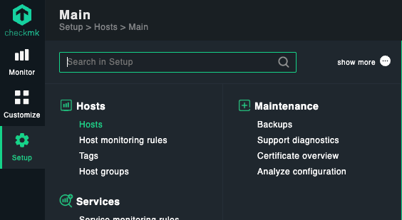
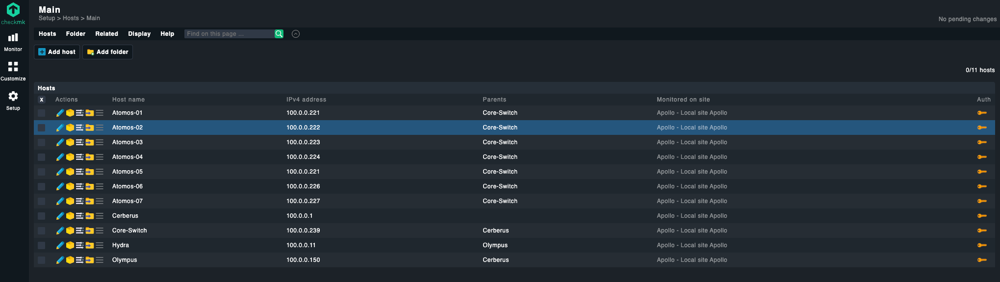
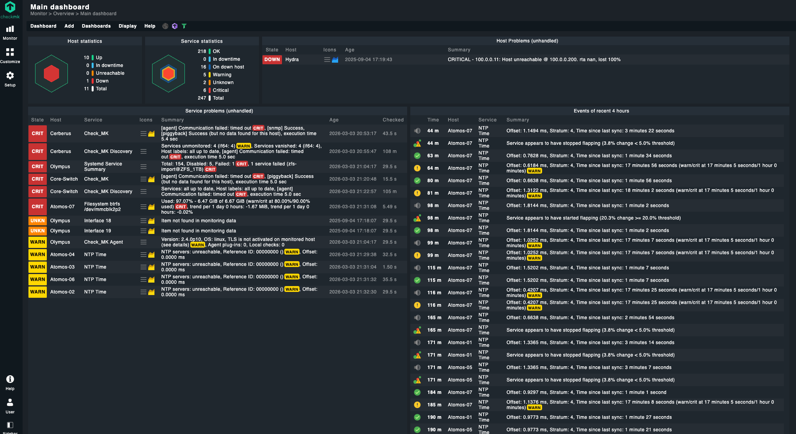
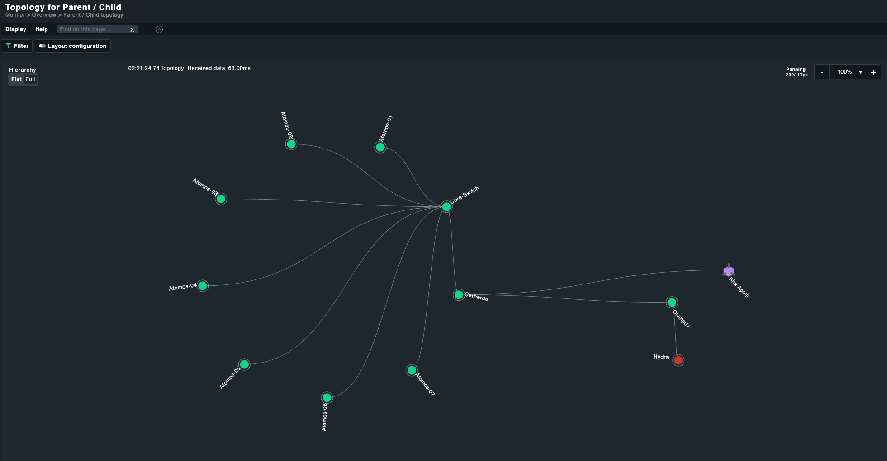
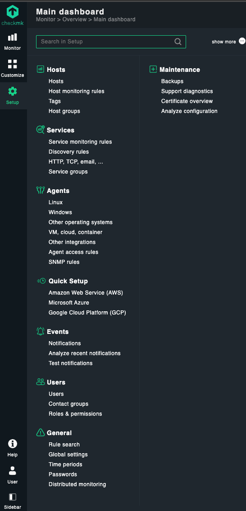
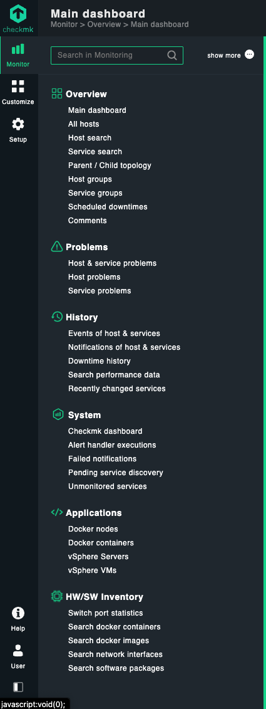

## System Update

First, update your system packages to ensure you have the latest security patches and dependencies:

```bash
apt update -y && apt upgrade -y
```

The `-y` flag automatically confirms "yes" to any prompts during the update process.

Example output:

```bash
root@Apollo:/home# apt update -y && apt upgrade -y
Get:1 http://archive.ubuntu.com/ubuntu jammy InRelease [270 kB]
Get:2 http://archive.ubuntu.com/ubuntu jammy-updates InRelease [128 kB]
Get:3 http://archive.ubuntu.com/ubuntu jammy-security InRelease [129 kB]
Get:4 http://archive.ubuntu.com/ubuntu jammy/main Translation-en [510 kB]
...
```

## Download Checkmk

Pull in the Checkmk package using wget:

```bash
wget https://download.checkmk.com/checkmk/2.4.0p10/check-mk-raw-2.4.0p10_0.jammy_amd64.deb
```

Example output:

```bash
--2025-09-02 17:51:13--  https://download.checkmk.com/checkmk/2.4.0p10/check-mk-raw-2.4.0p10_0.jammy_amd64.deb
Resolving download.checkmk.com (download.checkmk.com)... 45.133.11.29
Connecting to download.checkmk.com (download.checkmk.com)|45.133.11.29|:443... connected.
HTTP request sent, awaiting response... 200 OK
Length: 280537678 (268M) [application/x-debian-package]
Saving to: 'check-mk-raw-2.4.0p10_0.jammy_amd64.deb'

check-mk-raw-2.4.0p10_0.jammy_amd64.deb 100%[=================================================================>] 267.54M  4.18MB/s    in 58s
2025-09-02 17:52:12 (4.62 MB/s) - 'check-mk-raw-2.4.0p10_0.jammy_amd64.deb' saved [280537678/280537678]
```

**Note**: By downloading Checkmk, you agree to the End User License Agreement and General Terms & Conditions. The SHA-256 file hash for verification is:

```
bef1c7be6dc779503962e0c4c7c73076d6d524abc6af055e9682ae8197a6753a
```

## Install the Checkmk Package

Install the package including all dependencies:

```bash
sudo apt install ./check-mk-raw-2.4.0p10_0.jammy_amd64.deb
```

Verify the installation was successful by checking the OMD version:

```bash
omd version
```

Expected output:

```bash
OMD - Open Monitoring Distribution Version 2.4.0p10.cre
```

## Create a Checkmk Monitoring Site

Create a new Checkmk site (we'll name it `Apollo` in this example):

```bash
omd create Apollo
```

Example output:

```bash
Adding /opt/omd/sites/Apollo/tmp to /etc/fstab.
Creating temporary filesystem /omd/sites/Apollo/tmp...OK
Updating core configuration...
Generating configuration for core (type nagios)...
Precompiling host checks...OK
Executing post-create script "01_create-sample-config.py"...OK
Executing post-create script "02_cmk-compute-api-spec"...OK
Executing post-create script "03_message-broker-certs"...OK
Restarting Apache...OK
Created new site Apollo with version 2.4.0p10.cre.

The site can be started with omd start Apollo.
The default web UI is available at http://Apollo/Apollo/

The admin user for the web applications is cmkadmin with password: xxxxxxxxxx
For command line administration of the site, log in with 'omd su Apollo'.
After logging in, you can change the password for cmkadmin with 'cmk-passwd cmkadmin'.
```

## Start the Checkmk Site

Start your newly created monitoring site:

```bash
omd start
```

Example output:

```bash
Doing 'start' on site Apollo:
Starting agent-receiver...OK
Starting mkeventd...OK
Starting rrdcached...OK
Starting redis...OK
Starting npcd...OK
Starting automation-helper...OK
Starting ui-job-scheduler...OK
Starting nagios...OK
Starting apache...OK
Starting crontab...OK
```

## Accessing the Web Interface

Your Checkmk site is now up and running! You can access the web interface at the URL provided in the creation output (e.g., `http://your-server/Apollo/`).

## Initial Setup and Configuration

### Adding Monitoring Hosts

Once logged into the web interface, you can begin adding hosts to monitor:

* Navigate to **Setup > Hosts > Add host**
* Follow the step-by-step wizard to configure your monitoring targets
* Add new host and follow the steps




### Exploring the Dashboard

Checkmk provides a comprehensive default dashboard that gives you immediate visibility into your monitoring environment:



### Exploring Topology View



### Rich Configuration Options

The Setup menu offers extensive configuration capabilities for customizing your monitoring environment:



### Comprehensive Monitoring Features

Checkmk provides a wealth of monitoring tools and views to help you maintain optimal system performance:



## Next Steps

* Change the default cmkadmin password for security
* Configure email/SMS notifications for alerts
* Set up additional monitoring plugins and checks
* Explore the extensive documentation for advanced configurations
* Consider setting up distributed monitoring for larger environments

Checkmk offers enterprise-grade monitoring capabilities with an intuitive interface, making it an excellent choice for both small and large-scale monitoring deployments.

